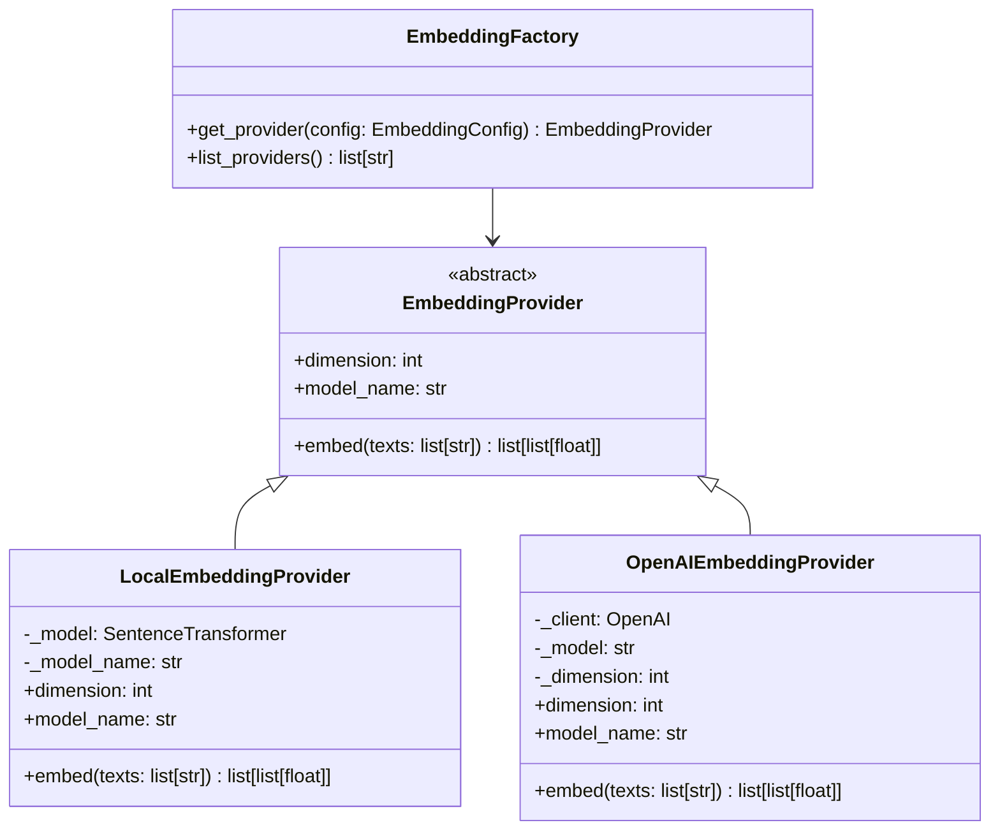

# Cloud Embeddings Design Document

## Overview

This design extends SpecMem's embedding system to support cloud-based embedding providers while maintaining the existing local embedding capability. The architecture follows the Strategy pattern with a factory for provider instantiation, enabling easy addition of new providers without modifying existing code.

## Architecture



## Components and Interfaces

### EmbeddingProvider (Abstract Base)

The existing abstract interface remains unchanged:

```python
class EmbeddingProvider(ABC):
    @abstractmethod
    def embed(self, texts: list[str]) -> list[list[float]]:
        """Generate embeddings for texts."""
        pass

    @property
    @abstractmethod
    def dimension(self) -> int:
        """Return embedding dimension."""
        pass

    @property
    @abstractmethod
    def model_name(self) -> str:
        """Return model identifier."""
        pass
```

### OpenAIEmbeddingProvider

New provider implementation for OpenAI embeddings:

```python
class OpenAIEmbeddingProvider(EmbeddingProvider):
    DEFAULT_MODEL = "text-embedding-3-small"
    MAX_BATCH_SIZE = 2048  # OpenAI limit

    def __init__(
        self,
        model: str = DEFAULT_MODEL,
        api_key: str | None = None,
    ) -> None:
        """Initialize with API key from param or OPENAI_API_KEY env var."""
        pass

    def embed(self, texts: list[str]) -> list[list[float]]:
        """Generate embeddings via OpenAI API with automatic batching."""
        pass
```

### EmbeddingConfig

Configuration dataclass for embedding settings:

```python
@dataclass
class EmbeddingConfig:
    provider: str = "local"  # "local", "openai", etc.
    model: str = "all-MiniLM-L6-v2"  # Provider-specific model
    api_key: str | None = None  # For cloud providers
```

### Factory Function Enhancement

Update the existing `get_embedding_provider` function:

```python
def get_embedding_provider(
    provider: str = "local",
    model: str | None = None,
    api_key: str | None = None,
) -> EmbeddingProvider:
    """Factory to instantiate embedding providers."""
    pass
```

## Data Models

### Error Codes

New error codes for cloud embedding failures:

| Code | Description |
|------|-------------|
| MISSING_API_KEY | API key not provided for cloud provider |
| NETWORK_ERROR | Network connectivity issue |
| RATE_LIMITED | API rate limit exceeded |
| AUTH_ERROR | Authentication/authorization failure |
| UNSUPPORTED_PROVIDER | Unknown provider name |

### Provider Registry

```python
SUPPORTED_PROVIDERS = {
    "local": LocalEmbeddingProvider,
    "openai": OpenAIEmbeddingProvider,
}

DEFAULT_MODELS = {
    "local": "all-MiniLM-L6-v2",
    "openai": "text-embedding-3-small",
}
```

## Correctness Properties

*A property is a characteristic or behavior that should hold true across all valid executions of a system-essentially, a formal statement about what the system should do. Properties serve as the bridge between human-readable specifications and machine-verifiable correctness guarantees.*

Based on the prework analysis, the following properties can be verified through property-based testing:

### Property 1: Factory returns correct provider type
*For any* valid provider name in the supported providers list, the factory SHALL return an instance of the corresponding provider class.
**Validates: Requirements 1.1, 2.1**

### Property 2: Unknown provider raises error
*For any* string not in the supported providers list, the factory SHALL raise an EmbeddingError with code "UNSUPPORTED_PROVIDER".
**Validates: Requirements 3.2**

### Property 3: Embedding dimension consistency
*For any* provider instance and any list of texts, all returned embedding vectors SHALL have the same dimension equal to the provider's declared dimension.
**Validates: Requirements 3.3**

### Property 4: Batch result count matches input
*For any* list of texts (including those exceeding batch limits), the embed method SHALL return exactly len(texts) embedding vectors.
**Validates: Requirements 4.2**

### Property 5: Error wrapping preserves details
*For any* exception raised by the underlying API, the wrapped EmbeddingError SHALL contain the original error message in its details.
**Validates: Requirements 1.3, 5.4**

### Property 6: Configuration round-trip
*For any* valid EmbeddingConfig, serializing to dict and deserializing SHALL produce an equivalent configuration.
**Validates: Requirements 2.4**

### Property 7: Environment variable API key usage
*For any* API key value set in the environment variable, the cloud provider SHALL receive that key when no explicit key is provided.
**Validates: Requirements 2.3**

## Error Handling

### Error Mapping Strategy

Cloud API errors are mapped to EmbeddingError codes:

```python
def _map_openai_error(error: Exception) -> EmbeddingError:
    """Map OpenAI exceptions to EmbeddingError."""
    if isinstance(error, openai.AuthenticationError):
        return EmbeddingError("...", code="AUTH_ERROR", ...)
    elif isinstance(error, openai.RateLimitError):
        return EmbeddingError("...", code="RATE_LIMITED", ...)
    elif isinstance(error, openai.APIConnectionError):
        return EmbeddingError("...", code="NETWORK_ERROR", ...)
    else:
        return EmbeddingError("...", code="API_ERROR", ...)
```

### Validation

- API key presence validated before API calls
- Empty text list returns empty result (no API call)
- Text content validated (non-empty strings)

## Testing Strategy

### Property-Based Testing

Use **Hypothesis** for property-based testing (already used in the project).

Each property test will:
- Run minimum 100 iterations
- Use smart generators for valid inputs
- Tag with the property being validated

Example structure:
```python
@given(st.sampled_from(list(SUPPORTED_PROVIDERS.keys())))
def test_factory_returns_correct_provider_type(provider_name: str):
    """**Feature: cloud-embeddings, Property 1: Factory returns correct provider type**"""
    # Test implementation
```

### Unit Tests

Unit tests cover:
- Default model selection per provider
- Missing API key error for cloud providers
- Specific error code mapping (edge cases)
- Integration with existing MemoryBank

### Test Organization

```
tests/
├── property/
│   └── test_embedding_props.py  # Property-based tests
└── unit/
    └── test_embeddings.py       # Unit tests for embeddings
```
