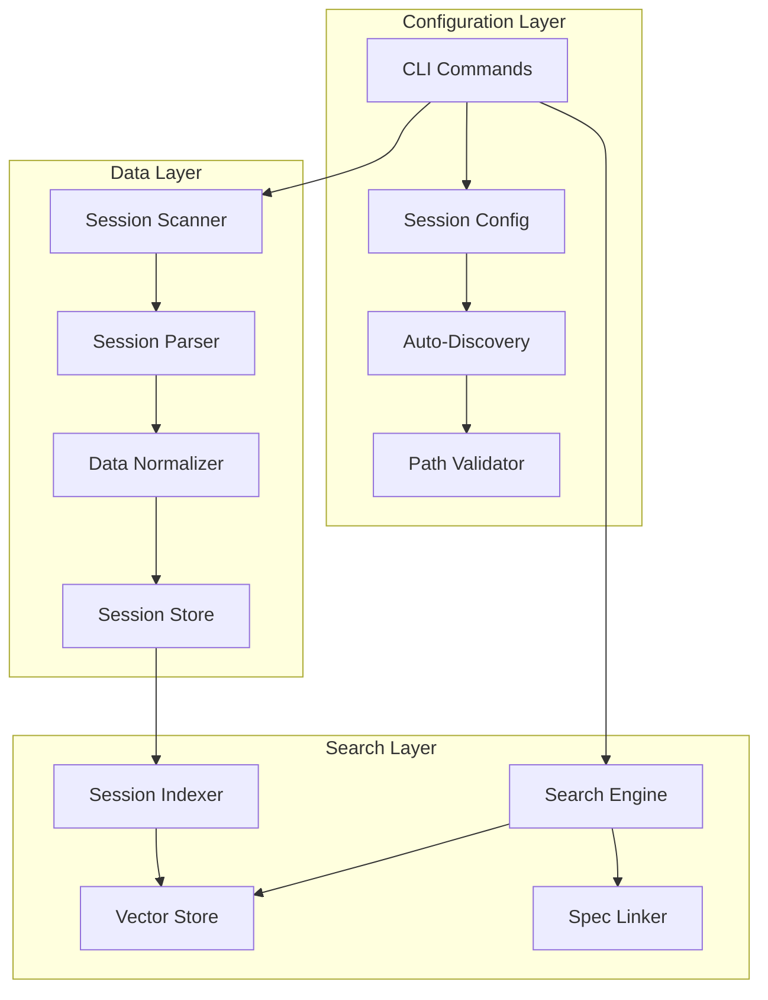

# Kiro Session Search - Design Document

## Overview

This design extends the existing Kiro adapter in SpecMem to support indexing and searching Kiro agent coding sessions. The feature enables developers to search through past conversations, find solutions to similar problems, and link sessions to specifications.

The design prioritizes:
1. **User consent** - No data access without explicit permission
2. **Platform compatibility** - Works on macOS, Linux, and Windows
3. **Privacy** - Workspace-only mode limits data exposure
4. **Extensibility** - Normalized data model supports future adapters

## Architecture



## Components and Interfaces

### 1. Session Discovery Component

Handles platform-specific auto-discovery of Kiro session directories.

```python
from pathlib import Path
from dataclasses import dataclass
from enum import Enum

class Platform(Enum):
    MACOS = "darwin"
    LINUX = "linux"
    WINDOWS = "win32"

@dataclass
class DiscoveryResult:
    """Result of auto-discovery attempt."""
    found_paths: list[Path]
    platform: Platform
    error: str | None = None

class SessionDiscovery:
    """Discovers Kiro session directories on the local system."""

    PLATFORM_PATHS = {
        Platform.MACOS: [
            "~/Library/Application Support/Kiro/workspace-sessions"
        ],
        Platform.LINUX: [
            "~/.config/Kiro/workspace-sessions",
            "~/.local/share/Kiro/workspace-sessions"
        ],
        Platform.WINDOWS: [
            "%APPDATA%/Kiro/workspace-sessions"
        ]
    }

    def discover(self, platform: Platform | None = None) -> DiscoveryResult:
        """Auto-discover Kiro session directories."""
        ...

    def validate_directory(self, path: Path) -> bool:
        """Check if directory contains valid session data."""
        ...

    def get_platform_paths(self, platform: Platform) -> list[Path]:
        """Get default paths for a specific platform."""
        ...
```

### 2. Session Configuration Component

Manages session search configuration with user consent flow.

```python
@dataclass
class SessionConfig:
    """Session search configuration."""
    sessions_path: Path | None = None
    workspace_only: bool = False
    enabled: bool = False

class SessionConfigManager:
    """Manages session search configuration."""

    def configure_interactive(self) -> SessionConfig:
        """Interactive configuration with permission prompt."""
        ...

    def configure_with_path(self, path: Path) -> SessionConfig:
        """Configure with explicit path (skips auto-discovery)."""
        ...

    def configure_auto(self) -> SessionConfig:
        """Auto-configure without prompts (assumes permission)."""
        ...

    def load_config(self) -> SessionConfig | None:
        """Load existing configuration from .specmem.toml."""
        ...

    def save_config(self, config: SessionConfig) -> None:
        """Save configuration to .specmem.toml."""
        ...

    def is_configured(self) -> bool:
        """Check if session search is configured."""
        ...
```

### 3. Session Parser Component

Parses Kiro session files into normalized data structures.

```python
@dataclass
class SessionMessage:
    """A single message in a session."""
    role: str  # "user" | "assistant" | "system"
    content: str
    timestamp_ms: int | None = None
    tool_calls: list[dict] | None = None

@dataclass
class Session:
    """Normalized session data model."""
    session_id: str
    title: str
    workspace_directory: str
    date_created_ms: int
    messages: list[SessionMessage]
    metadata: dict

class KiroSessionParser:
    """Parses Kiro session files."""

    def parse_sessions_index(self, index_path: Path) -> list[dict]:
        """Parse sessions.json index file."""
        ...

    def parse_session_file(self, session_path: Path) -> Session:
        """Parse individual session JSON file."""
        ...

    def flatten_content(self, content: list | str) -> str:
        """Flatten content arrays into readable text."""
        ...

    def extract_tool_calls(self, message: dict) -> list[dict]:
        """Extract tool call information from message."""
        ...
```

### 4. Session Scanner Component

Scans configured directory for sessions.

```python
class SessionScanner:
    """Scans for Kiro sessions in configured directory."""

    def __init__(self, config: SessionConfig):
        self.config = config

    def scan(self, workspace_filter: Path | None = None) -> list[Session]:
        """Scan for sessions, optionally filtered by workspace."""
        ...

    def decode_workspace_path(self, encoded: str) -> Path:
        """Decode base64-encoded workspace path."""
        ...

    def list_workspace_directories(self) -> list[Path]:
        """List all workspace directories in sessions folder."""
        ...
```

### 5. Session Indexer Component

Indexes sessions for semantic search.

```python
class SessionIndexer:
    """Indexes sessions for search."""

    def __init__(self, vector_store: VectorStore):
        self.vector_store = vector_store

    def index_session(self, session: Session) -> None:
        """Index a single session."""
        ...

    def index_sessions(self, sessions: list[Session]) -> int:
        """Batch index multiple sessions. Returns count indexed."""
        ...

    def remove_session(self, session_id: str) -> None:
        """Remove session from index."""
        ...
```

### 6. Session Search Engine

Provides search functionality across indexed sessions.

```python
@dataclass
class SearchFilters:
    """Filters for session search."""
    workspace: Path | None = None
    since_ms: int | None = None
    until_ms: int | None = None
    limit: int = 10

@dataclass
class SearchResult:
    """A single search result."""
    session: Session
    score: float
    matched_messages: list[int]  # indices of matching messages

class SessionSearchEngine:
    """Searches indexed sessions."""

    def search(
        self,
        query: str,
        filters: SearchFilters | None = None
    ) -> list[SearchResult]:
        """Search sessions by query with optional filters."""
        ...

    def list_recent(
        self,
        limit: int = 10,
        workspace: Path | None = None
    ) -> list[Session]:
        """List recent sessions."""
        ...

    def get_session(self, session_id: str) -> Session | None:
        """Get a specific session by ID."""
        ...
```

### 7. Spec Linker Component

Links sessions to specifications.

```python
@dataclass
class SessionSpecLink:
    """Link between a session and a spec."""
    session_id: str
    spec_id: str
    confidence: float
    link_type: str  # "file_ref" | "semantic" | "manual"

class SpecLinker:
    """Links sessions to specifications."""

    def detect_spec_references(self, session: Session) -> list[str]:
        """Detect spec file references in session content."""
        ...

    def create_links(self, session: Session) -> list[SessionSpecLink]:
        """Create links between session and detected specs."""
        ...

    def get_sessions_for_spec(self, spec_id: str) -> list[Session]:
        """Get all sessions linked to a spec."""
        ...

    def get_specs_for_session(self, session_id: str) -> list[str]:
        """Get all spec IDs linked to a session."""
        ...
```

## Data Models

### Session Storage Schema

```python
# Stored in .specmem/sessions.db (SQLite)

"""
CREATE TABLE sessions (
    session_id TEXT PRIMARY KEY,
    title TEXT NOT NULL,
    workspace_directory TEXT NOT NULL,
    date_created_ms INTEGER NOT NULL,
    message_count INTEGER NOT NULL,
    metadata_json TEXT,
    indexed_at_ms INTEGER NOT NULL
);

CREATE TABLE session_messages (
    id INTEGER PRIMARY KEY AUTOINCREMENT,
    session_id TEXT NOT NULL,
    message_index INTEGER NOT NULL,
    role TEXT NOT NULL,
    content TEXT NOT NULL,
    timestamp_ms INTEGER,
    FOREIGN KEY (session_id) REFERENCES sessions(session_id)
);

CREATE TABLE session_spec_links (
    session_id TEXT NOT NULL,
    spec_id TEXT NOT NULL,
    confidence REAL NOT NULL,
    link_type TEXT NOT NULL,
    PRIMARY KEY (session_id, spec_id)
);

CREATE INDEX idx_sessions_workspace ON sessions(workspace_directory);
CREATE INDEX idx_sessions_date ON sessions(date_created_ms);
CREATE INDEX idx_messages_session ON session_messages(session_id);
"""
```

### Configuration Schema

```toml
# .specmem.toml additions

[sessions]
enabled = true
path = "~/Library/Application Support/Kiro/workspace-sessions"
workspace_only = false
```

### Kiro Session File Format (Reference)

```json
// sessions.json (index file)
{
  "sessions": [
    {
      "sessionId": "abc123",
      "title": "Implement auth feature",
      "dateCreated": "2025-01-15T10:30:00Z",
      "workspaceDirectory": "/Users/dev/myproject"
    }
  ]
}

// Individual session file: abc123.json
{
  "sessionId": "abc123",
  "history": [
    {
      "role": "user",
      "content": "Help me implement authentication"
    },
    {
      "role": "assistant",
      "content": [
        {"type": "text", "text": "I'll help you..."},
        {"type": "tool_use", "name": "readFile", "input": {...}}
      ]
    }
  ]
}
```

## Correctness Properties

*A property is a characteristic or behavior that should hold true across all valid executions of a system-essentially, a formal statement about what the system should do. Properties serve as the bridge between human-readable specifications and machine-verifiable correctness guarantees.*

### Property 1: Platform path correctness
*For any* platform (macOS, Linux, Windows), the auto-discovery SHALL check exactly the documented default paths for that platform and no others.
**Validates: Requirements 0.1.1, 0.1.2, 0.1.3**

### Property 2: Directory validation correctness
*For any* directory path, validation SHALL return true if and only if the directory exists AND contains at least one valid session JSON file.
**Validates: Requirements 0.1.5, 0.8**

### Property 3: Explicit path bypasses discovery
*For any* explicit path provided via `--path`, the system SHALL use that path directly without checking platform default locations.
**Validates: Requirements 0.7**

### Property 4: Configured path restriction
*For any* session operation, the system SHALL only access files within the configured sessions directory path.
**Validates: Requirements 0.9, 1.1**

### Property 5: Base64 workspace path round-trip
*For any* workspace path, encoding to base64 then decoding SHALL produce the original path.
**Validates: Requirements 1.2**

### Property 6: Session metadata extraction completeness
*For any* valid sessions.json file, parsing SHALL extract all required fields (sessionId, title, dateCreated, workspaceDirectory) for every session entry.
**Validates: Requirements 1.3**

### Property 7: Message history completeness
*For any* valid session JSON file, parsing SHALL preserve all messages in order with their roles intact.
**Validates: Requirements 1.4, 3.1, 3.2**

### Property 8: Content flattening produces readable text
*For any* content array (including text and tool_use items), flattening SHALL produce a non-empty string containing all text content and tool names.
**Validates: Requirements 3.3, 3.4, 6.3**

### Property 9: Search results contain required metadata
*For any* search result, the result SHALL include session title, workspace directory, and date created.
**Validates: Requirements 2.2**

### Property 10: Search results are ordered by relevance
*For any* search query returning multiple results, results SHALL be ordered by descending relevance score.
**Validates: Requirements 2.3**

### Property 11: Time filter correctness
*For any* time filter (since/until), all returned sessions SHALL have dateCreated within the specified range.
**Validates: Requirements 2.4**

### Property 12: Workspace filter correctness
*For any* workspace filter, all returned sessions SHALL have workspaceDirectory matching the filter path.
**Validates: Requirements 2.5, 7.2**

### Property 13: Bidirectional spec linking
*For any* session-spec link, querying sessions for that spec SHALL include the session, AND querying specs for that session SHALL include the spec.
**Validates: Requirements 4.2, 4.3, 4.4**

### Property 14: Role normalization correctness
*For any* Kiro role value, normalization SHALL map to exactly one of: "user", "assistant", or "system".
**Validates: Requirements 6.2**

### Property 15: Timestamp normalization correctness
*For any* valid timestamp string, normalization SHALL produce a positive integer representing Unix milliseconds.
**Validates: Requirements 6.4**

### Property 16: Workspace-only mode isolation
*For any* session search in workspace-only mode, no sessions from other workspaces SHALL be returned or accessed.
**Validates: Requirements 7.1, 7.3**

## Error Handling

### Configuration Errors
- `SessionNotConfiguredError`: Raised when session commands are run without configuration
- `InvalidSessionPathError`: Raised when configured path doesn't exist or is invalid
- `DiscoveryFailedError`: Raised when auto-discovery finds no valid directories

### Parsing Errors
- `SessionParseError`: Raised when session file is malformed
- `InvalidSessionIndexError`: Raised when sessions.json is invalid

### Search Errors
- `SessionNotFoundError`: Raised when requested session ID doesn't exist

```python
class SessionError(SpecMemError):
    """Base class for session-related errors."""
    pass

class SessionNotConfiguredError(SessionError):
    """Session search is not configured."""
    def __init__(self):
        super().__init__(
            "Session search is not configured. "
            "Run 'specmem sessions config' to set up."
        )

class InvalidSessionPathError(SessionError):
    """Configured session path is invalid."""
    def __init__(self, path: Path, reason: str):
        super().__init__(f"Invalid session path '{path}': {reason}")

class DiscoveryFailedError(SessionError):
    """Auto-discovery failed to find valid directories."""
    def __init__(self, platform: str, checked_paths: list[str]):
        paths_str = "\n  ".join(checked_paths)
        super().__init__(
            f"Could not find Kiro sessions directory on {platform}.\n"
            f"Checked:\n  {paths_str}\n\n"
            "Please provide the path manually:\n"
            "  specmem sessions config --path /path/to/workspace-sessions"
        )
```

## Testing Strategy

### Unit Tests
- Session parser for various Kiro session formats
- Content flattening with different content types
- Platform path resolution
- Configuration loading/saving

### Property-Based Tests
Using `hypothesis` library for Python:

```python
from hypothesis import given, strategies as st

# Property 5: Base64 round-trip
@given(st.text(min_size=1))
def test_workspace_path_roundtrip(path: str):
    """Encoding then decoding workspace path returns original."""
    encoded = encode_workspace_path(path)
    decoded = decode_workspace_path(encoded)
    assert decoded == path

# Property 10: Search results ordered by score
@given(st.lists(st.floats(min_value=0, max_value=1), min_size=2))
def test_search_results_ordered(scores: list[float]):
    """Search results are ordered by descending score."""
    results = [SearchResult(score=s, ...) for s in scores]
    sorted_results = sort_by_relevance(results)
    for i in range(len(sorted_results) - 1):
        assert sorted_results[i].score >= sorted_results[i + 1].score

# Property 11: Time filter correctness
@given(
    st.integers(min_value=0),  # since_ms
    st.integers(min_value=0),  # until_ms
    st.lists(st.integers(min_value=0))  # session dates
)
def test_time_filter_correctness(since_ms, until_ms, dates):
    """All filtered sessions are within time range."""
    if since_ms > until_ms:
        since_ms, until_ms = until_ms, since_ms
    sessions = [Session(date_created_ms=d, ...) for d in dates]
    filtered = filter_by_time(sessions, since_ms, until_ms)
    for session in filtered:
        assert since_ms <= session.date_created_ms <= until_ms
```

### Integration Tests
- End-to-end configuration flow
- Session indexing and search workflow
- CLI command execution
- Spec linking detection

## CLI Interface

```bash
# Configuration
specmem sessions config                    # Interactive with permission prompt
specmem sessions config --path <dir>       # Direct path, skip discovery
specmem sessions config --auto             # Auto-discover without prompt
specmem sessions config --help             # Show platform paths and guidance

# Search and List
specmem sessions search "query"            # Search sessions
specmem sessions search "query" --limit 5  # Limit results
specmem sessions search "query" --since 7d # Filter by time
specmem sessions search "query" --robot    # JSON output for agents
specmem sessions list                      # List recent sessions
specmem sessions list --workspace-only     # Only current workspace

# View
specmem sessions view <session-id>         # View full conversation
specmem sessions view <session-id> --robot # JSON output
```

## Security Considerations

1. **No default access**: Session data is never accessed without explicit configuration
2. **User confirmation**: Auto-discovered paths require user confirmation before use
3. **Path restriction**: All file operations are restricted to the configured directory
4. **Workspace isolation**: Optional workspace-only mode limits exposure to current project
5. **Local only**: Session data never leaves the local machine
