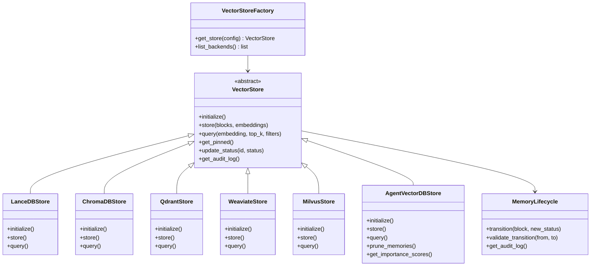

# Pluggable Vector Store Design Document

## Overview

This design extends SpecMem's vector storage layer to support multiple backends while enhancing memory lifecycle management. The architecture uses the Strategy pattern for backend abstraction and a State Machine pattern for lifecycle management, enabling intelligent agent recall governance.

## Architecture



## Components and Interfaces

### VectorStore (Abstract Base)

Enhanced interface with lifecycle and audit support:

```python
class VectorStore(ABC):
    @abstractmethod
    def initialize(self) -> None:
        """Initialize the vector store connection."""
        pass

    @abstractmethod
    def store(self, blocks: list[SpecBlock], embeddings: list[list[float]]) -> None:
        """Store blocks with their embeddings."""
        pass

    @abstractmethod
    def query(
        self,
        embedding: list[float],
        top_k: int = 10,
        include_deprecated: bool = False,
        include_legacy: bool = False,
        governance_rules: GovernanceRules | None = None,
    ) -> list[QueryResult]:
        """Query for similar blocks with lifecycle filtering."""
        pass

    @abstractmethod
    def update_status(self, block_id: str, status: SpecStatus, reason: str = "") -> bool:
        """Update block lifecycle status with transition validation."""
        pass

    @abstractmethod
    def get_audit_log(self, limit: int = 100) -> list[AuditEntry]:
        """Get obsolete blocks from audit log."""
        pass
```

### Backend Implementations

#### ChromaDBStore
```python
class ChromaDBStore(VectorStore):
    """ChromaDB backend using chromadb>=1.3.5"""

    def __init__(self, path: str = ".specmem/chroma", collection: str = "specmem"):
        self._client = None
        self._collection = None
        self._path = path
        self._collection_name = collection
```

#### QdrantStore
```python
class QdrantStore(VectorStore):
    """Qdrant backend using qdrant-client>=1.16.1"""

    def __init__(
        self,
        path: str = ".specmem/qdrant",
        url: str | None = None,
        api_key: str | None = None,
    ):
        self._path = path
        self._url = url
        self._api_key = api_key
```

#### WeaviateStore
```python
class WeaviateStore(VectorStore):
    """Weaviate backend using weaviate-client>=4.0.0"""

    def __init__(
        self,
        url: str = "http://localhost:8080",
        api_key: str | None = None,
    ):
        self._url = url
        self._api_key = api_key
```

#### MilvusStore
```python
class MilvusStore(VectorStore):
    """Milvus backend using pymilvus>=2.6.6"""

    def __init__(
        self,
        uri: str = ".specmem/milvus.db",
        collection: str = "specmem",
    ):
        self._uri = uri
        self._collection_name = collection
```

#### AgentVectorDBStore (Enhanced)
```python
class AgentVectorDBStore(VectorStore):
    """AgentVectorDB backend with advanced memory features.

    Uses agentvectordb>=0.0.3 for agent-optimized storage.
    """

    def __init__(
        self,
        db_path: str = ".specmem/agentvectordb",
        namespace: str = "default",
        enable_importance_scoring: bool = True,
        enable_memory_decay: bool = True,
        decay_rate: float = 0.1,
    ):
        self._db_path = db_path
        self._namespace = namespace
        self._importance_scoring = enable_importance_scoring
        self._memory_decay = enable_memory_decay
        self._decay_rate = decay_rate

    def prune_memories(
        self,
        max_age_seconds: int | None = None,
        min_importance: float | None = None,
    ) -> int:
        """Prune old/unimportant memories."""
        pass

    def consolidate_memories(self) -> int:
        """Consolidate similar memories."""
        pass
```

### Memory Lifecycle State Machine

```python
class SpecStatus(str, Enum):
    ACTIVE = "active"
    DEPRECATED = "deprecated"
    LEGACY = "legacy"
    OBSOLETE = "obsolete"

# Valid transitions
VALID_TRANSITIONS = {
    SpecStatus.ACTIVE: {SpecStatus.DEPRECATED, SpecStatus.LEGACY},
    SpecStatus.DEPRECATED: {SpecStatus.LEGACY, SpecStatus.ACTIVE},  # Can reactivate
    SpecStatus.LEGACY: {SpecStatus.OBSOLETE, SpecStatus.DEPRECATED},  # Can undeprecate
    SpecStatus.OBSOLETE: set(),  # Terminal state
}
```

### Governance Rules

```python
@dataclass
class GovernanceRules:
    """Rules for controlling memory retrieval."""
    max_age_days: int | None = None
    exclude_types: list[SpecType] = field(default_factory=list)
    exclude_sources: list[str] = field(default_factory=list)
    min_importance: float | None = None
```

## Data Models

### AuditEntry

```python
@dataclass
class AuditEntry:
    """Record of obsolete block for audit purposes."""
    block: SpecBlock
    obsoleted_at: datetime
    reason: str
    previous_status: SpecStatus
    transition_history: list[dict]
```

### QueryResult (Enhanced)

```python
@dataclass
class QueryResult:
    block: SpecBlock
    score: float
    distance: float
    deprecation_warning: str | None = None  # Set if block is deprecated
    importance_score: float | None = None   # From AgentVectorDB
```

### Backend Registry

```python
SUPPORTED_BACKENDS = {
    "lancedb": LanceDBStore,
    "chroma": ChromaDBStore,
    "qdrant": QdrantStore,
    "weaviate": WeaviateStore,
    "milvus": MilvusStore,
    "agentvectordb": AgentVectorDBStore,
}
```

## Correctness Properties

*A property is a characteristic or behavior that should hold true across all valid executions of a system-essentially, a formal statement about what the system should do. Properties serve as the bridge between human-readable specifications and machine-verifiable correctness guarantees.*

### Property 1: Factory returns correct backend type
*For any* valid backend name in SUPPORTED_BACKENDS, the factory SHALL return an instance of the corresponding store class.
**Validates: Requirements 1.1, 1.2, 1.3, 1.4, 1.5, 1.6**

### Property 2: Unknown backend raises error
*For any* string not in SUPPORTED_BACKENDS, the factory SHALL raise a VectorStoreError with code "UNSUPPORTED_BACKEND".
**Validates: Requirements 2.3**

### Property 3: Interface consistency across backends
*For any* backend and any valid SpecBlock list, storing and then querying SHALL return results in the same QueryResult format.
**Validates: Requirements 3.1, 3.2**

### Property 4: Deprecated blocks excluded by default
*For any* query without include_deprecated flag, the results SHALL NOT contain blocks with status=deprecated.
**Validates: Requirements 4.3**

### Property 5: Legacy blocks excluded by default
*For any* query without include_legacy flag, the results SHALL NOT contain blocks with status=legacy.
**Validates: Requirements 5.1**

### Property 6: Obsolete blocks never returned
*For any* query with any combination of flags, the results SHALL NOT contain blocks with status=obsolete.
**Validates: Requirements 6.2**

### Property 7: Valid lifecycle transitions succeed
*For any* block and any transition in VALID_TRANSITIONS, update_status SHALL succeed and record the transition.
**Validates: Requirements 7.1, 7.2, 7.3, 7.5**

### Property 8: Invalid lifecycle transitions fail
*For any* block and any transition NOT in VALID_TRANSITIONS, update_status SHALL raise LifecycleError.
**Validates: Requirements 7.4**

### Property 9: Audit log contains obsolete blocks
*For any* block transitioned to obsolete, the audit log SHALL contain the complete block data.
**Validates: Requirements 6.1, 6.3**

### Property 10: Governance rules filter results
*For any* query with governance rules, results SHALL only contain blocks matching all rule criteria.
**Validates: Requirements 9.1, 9.2, 9.3, 9.4**

### Property 11: AgentVectorDB importance scoring
*For any* query using AgentVectorDB backend, results SHALL include importance_score field.
**Validates: Requirements 8.2**

## Error Handling

### Error Codes

| Code | Description |
|------|-------------|
| UNSUPPORTED_BACKEND | Unknown backend name |
| BACKEND_INIT_ERROR | Failed to initialize backend |
| LIFECYCLE_ERROR | Invalid state transition |
| GOVERNANCE_ERROR | Invalid governance rule |
| AUDIT_ERROR | Audit log operation failed |

### Lifecycle Error Details

```python
class LifecycleError(SpecMemError):
    def __init__(
        self,
        message: str,
        from_status: SpecStatus,
        to_status: SpecStatus,
        block_id: str,
    ):
        super().__init__(
            message,
            code="LIFECYCLE_ERROR",
            details={
                "from_status": from_status.value,
                "to_status": to_status.value,
                "block_id": block_id,
                "valid_transitions": [s.value for s in VALID_TRANSITIONS.get(from_status, set())],
            },
        )
```

## Testing Strategy

### Property-Based Testing

Use **Hypothesis** for property-based testing with smart generators:

```python
# Backend generator
backend_strategy = st.sampled_from(list(SUPPORTED_BACKENDS.keys()))

# Status transition generator
valid_transition_strategy = st.sampled_from([
    (SpecStatus.ACTIVE, SpecStatus.DEPRECATED),
    (SpecStatus.DEPRECATED, SpecStatus.LEGACY),
    (SpecStatus.LEGACY, SpecStatus.OBSOLETE),
])
```

### Test Organization

```
tests/
├── property/
│   └── test_vectordb_props.py  # Property tests for backends
│   └── test_lifecycle_props.py # Property tests for lifecycle
└── unit/
    └── test_backends.py        # Unit tests per backend
```

### Mocking Strategy

For cloud backends (Qdrant cloud, Weaviate cloud), use mocked clients in tests to avoid external dependencies. Local/embedded modes should be tested with real instances.
