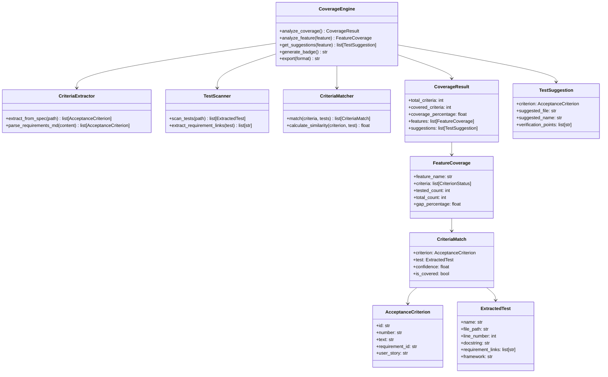

# Spec Coverage Design Document

## Overview

The Spec Coverage feature provides analysis of the gap between specification acceptance criteria and existing tests. It enables developers and coding agents to:
1. View coverage reports showing which criteria have tests
2. Get suggestions for writing tests for uncovered criteria
3. Generate badges and export coverage data
4. Access coverage data programmatically via the SpecMemClient API

The feature is accessed via the `specmem cov` command with subcommands: `report`, `suggest`, `badge`, and `export`.

## Architecture



## Components and Interfaces

### AcceptanceCriterion

Represents an extracted acceptance criterion from a spec:

```python
@dataclass
class AcceptanceCriterion:
    """Acceptance criterion extracted from requirements.md."""

    id: str                    # Unique identifier (e.g., "user-auth.1.3")
    number: str                # Criterion number (e.g., "1.3")
    text: str                  # Full EARS format text
    requirement_id: str        # Parent requirement ID (e.g., "1")
    user_story: str            # Parent user story text
    feature_name: str          # Feature this belongs to

    def to_dict(self) -> dict:
        """Serialize to dictionary."""

    @classmethod
    def from_dict(cls, data: dict) -> "AcceptanceCriterion":
        """Deserialize from dictionary."""
```

### ExtractedTest

Represents a test function extracted from test files:

```python
@dataclass
class ExtractedTest:
    """Test function extracted from test files."""

    name: str                  # Test function/method name
    file_path: str             # Path to test file
    line_number: int           # Line number in file
    docstring: str | None      # Test docstring or comment
    requirement_links: list[str] = field(default_factory=list)  # Explicit links
    framework: str = "unknown" # Test framework (pytest, jest, etc.)
    selector: str = ""         # Framework-specific selector

    def to_dict(self) -> dict:
        """Serialize to dictionary."""

    @classmethod
    def from_dict(cls, data: dict) -> "ExtractedTest":
        """Deserialize from dictionary."""
```

### CriteriaMatch

Represents a match between a criterion and a test:

```python
@dataclass
class CriteriaMatch:
    """Match between an acceptance criterion and a test."""

    criterion: AcceptanceCriterion
    test: ExtractedTest | None  # None if uncovered
    confidence: float           # 0.0 to 1.0
    is_covered: bool            # True if confidence >= 0.5

    def to_dict(self) -> dict:
        """Serialize to dictionary."""
```

### FeatureCoverage

Coverage data for a single feature:

```python
@dataclass
class FeatureCoverage:
    """Coverage data for a single feature."""

    feature_name: str
    criteria: list[CriteriaMatch]
    tested_count: int
    total_count: int

    @property
    def coverage_percentage(self) -> float:
        """Calculate coverage percentage."""
        if self.total_count == 0:
            return 100.0
        return (self.tested_count / self.total_count) * 100

    @property
    def gap_percentage(self) -> float:
        """Calculate gap percentage."""
        return 100.0 - self.coverage_percentage

    def to_dict(self) -> dict:
        """Serialize to dictionary."""
```

### CoverageResult

Overall coverage analysis result:

```python
@dataclass
class CoverageResult:
    """Overall coverage analysis result."""

    features: list[FeatureCoverage]
    suggestions: list[TestSuggestion] = field(default_factory=list)

    @property
    def total_criteria(self) -> int:
        """Total number of acceptance criteria."""
        return sum(f.total_count for f in self.features)

    @property
    def covered_criteria(self) -> int:
        """Number of covered criteria."""
        return sum(f.tested_count for f in self.features)

    @property
    def coverage_percentage(self) -> float:
        """Overall coverage percentage."""
        if self.total_criteria == 0:
            return 100.0
        return (self.covered_criteria / self.total_criteria) * 100

    def to_dict(self) -> dict:
        """Serialize to dictionary."""

    def to_json(self) -> str:
        """Export as JSON string."""

    def to_markdown(self) -> str:
        """Export as markdown table."""
```

### TestSuggestion

Suggestion for writing a test:

```python
@dataclass
class TestSuggestion:
    """Suggestion for writing a test for an uncovered criterion."""

    criterion: AcceptanceCriterion
    suggested_file: str         # Recommended test file path
    suggested_name: str         # Recommended test function name
    verification_points: list[str]  # What to verify in the test

    def to_dict(self) -> dict:
        """Serialize to dictionary."""
```

### CriteriaExtractor

Extracts acceptance criteria from spec files:

```python
class CriteriaExtractor:
    """Extracts acceptance criteria from spec files."""

    def __init__(self, workspace_path: Path) -> None:
        """Initialize with workspace path."""

    def extract_from_spec(self, spec_path: Path) -> list[AcceptanceCriterion]:
        """Extract all criteria from a spec's requirements.md."""

    def extract_all(self) -> dict[str, list[AcceptanceCriterion]]:
        """Extract criteria from all specs in workspace."""

    def parse_requirements_md(
        self,
        content: str,
        feature_name: str,
    ) -> list[AcceptanceCriterion]:
        """Parse requirements.md content and extract criteria."""
```

### TestScanner

Scans test files and extracts test information:

```python
class TestScanner:
    """Scans test files and extracts test information."""

    def __init__(self, workspace_path: Path) -> None:
        """Initialize with workspace path."""

    def scan_tests(self) -> list[ExtractedTest]:
        """Scan all test files in workspace."""

    def extract_requirement_links(self, test: ExtractedTest) -> list[str]:
        """Extract requirement links from test docstring/comments."""

    def _parse_pytest_file(self, path: Path) -> list[ExtractedTest]:
        """Parse pytest test file."""

    def _parse_jest_file(self, path: Path) -> list[ExtractedTest]:
        """Parse jest/vitest test file."""
```

### CriteriaMatcher

Matches criteria to tests using semantic similarity:

```python
class CriteriaMatcher:
    """Matches acceptance criteria to tests."""

    CONFIDENCE_THRESHOLD = 0.5

    def __init__(self) -> None:
        """Initialize the matcher."""

    def match(
        self,
        criteria: list[AcceptanceCriterion],
        tests: list[ExtractedTest],
    ) -> list[CriteriaMatch]:
        """Match criteria to tests."""

    def calculate_similarity(
        self,
        criterion: AcceptanceCriterion,
        test: ExtractedTest,
    ) -> float:
        """Calculate similarity score between criterion and test."""

    def _check_explicit_link(
        self,
        criterion: AcceptanceCriterion,
        test: ExtractedTest,
    ) -> bool:
        """Check if test explicitly links to criterion."""
```

### CoverageEngine

Main engine for coverage analysis:

```python
class CoverageEngine:
    """Main engine for spec coverage analysis."""

    def __init__(self, workspace_path: Path) -> None:
        """Initialize the coverage engine."""
        self.workspace_path = workspace_path
        self.extractor = CriteriaExtractor(workspace_path)
        self.scanner = TestScanner(workspace_path)
        self.matcher = CriteriaMatcher()

    def analyze_coverage(self) -> CoverageResult:
        """Analyze coverage for all specs."""

    def analyze_feature(self, feature_name: str) -> FeatureCoverage:
        """Analyze coverage for a specific feature."""

    def get_suggestions(
        self,
        feature_name: str | None = None,
    ) -> list[TestSuggestion]:
        """Get test suggestions for uncovered criteria."""

    def generate_badge(self) -> str:
        """Generate coverage badge markdown."""

    def export(self, format: str = "json") -> str:
        """Export coverage data in specified format."""
```

## Data Models

### Badge Colors

```python
class BadgeColor(str, Enum):
    """Badge colors based on coverage percentage."""

    RED = "red"      # < 50%
    YELLOW = "yellow"  # 50-80%
    GREEN = "green"   # > 80%

def get_badge_color(coverage_percentage: float) -> BadgeColor:
    """Get badge color based on coverage percentage."""
    if coverage_percentage < 50:
        return BadgeColor.RED
    elif coverage_percentage <= 80:
        return BadgeColor.YELLOW
    else:
        return BadgeColor.GREEN
```

### Export Formats

```python
class ExportFormat(str, Enum):
    """Supported export formats."""

    JSON = "json"
    MARKDOWN = "markdown"
    HTML = "html"
```

## Correctness Properties

*A property is a characteristic or behavior that should hold true across all valid executions of a system-essentially, a formal statement about what the system should do. Properties serve as the bridge between human-readable specifications and machine-verifiable correctness guarantees.*

### Property 1: Coverage Calculation Consistency

*For any* CoverageResult, the coverage_percentage SHALL equal (covered_criteria / total_criteria) * 100, and gap_percentage SHALL equal 100 - coverage_percentage.

**Validates: Requirements 1.3**

### Property 2: Criteria Extraction Completeness

*For any* requirements.md file with numbered acceptance criteria, the extractor SHALL extract all criteria with their number, text, and parent requirement linkage preserved.

**Validates: Requirements 3.1, 3.2, 3.3, 3.4**

### Property 3: Test Extraction Completeness

*For any* test file in a supported framework, the scanner SHALL extract all test functions with name, file_path, line_number, and any requirement links present.

**Validates: Requirements 4.1, 4.2, 4.4**

### Property 4: Confidence Score Range

*For any* CriteriaMatch, the confidence score SHALL be between 0.0 and 1.0, and explicit requirement links SHALL have confidence 1.0.

**Validates: Requirements 5.2, 5.3**

### Property 5: Coverage Threshold Behavior

*For any* CriteriaMatch with confidence below 0.5, is_covered SHALL be False; for confidence >= 0.5, is_covered SHALL be True.

**Validates: Requirements 5.4**

### Property 6: Highest Confidence Selection

*For any* criterion with multiple matching tests, the selected match SHALL have the highest confidence score among all candidates.

**Validates: Requirements 5.5**

### Property 7: Suggestion Completeness

*For any* TestSuggestion, it SHALL contain suggested_file, suggested_name, and at least one verification_point.

**Validates: Requirements 6.2, 6.3, 6.4**

### Property 8: Badge Color Thresholds

*For any* coverage percentage, badge color SHALL be red if < 50%, yellow if 50-80%, and green if > 80%.

**Validates: Requirements 7.3, 7.4, 7.5**

### Property 9: Export Round-Trip

*For any* CoverageResult, exporting to JSON then parsing SHALL produce an equivalent CoverageResult with all features, criteria, and confidence scores preserved.

**Validates: Requirements 8.1, 8.3, 8.4**

### Property 10: API Result Completeness

*For any* call to get_coverage(), the returned CoverageResult SHALL contain all features with their criteria, test mappings, confidence scores, and suggestions for uncovered criteria.

**Validates: Requirements 9.1, 9.3, 9.4**

## Error Handling

```python
class CoverageError(SpecMemError):
    """Base error for coverage operations."""
    pass

class CriteriaExtractionError(CoverageError):
    """Error extracting acceptance criteria."""
    pass

class TestScanError(CoverageError):
    """Error scanning test files."""
    pass

class MatchingError(CoverageError):
    """Error matching criteria to tests."""
    pass
```

## Testing Strategy

### Property-Based Testing

Use **Hypothesis** for property-based testing:

```python
from hypothesis import given, strategies as st

# AcceptanceCriterion strategy
criterion_strategy = st.builds(
    AcceptanceCriterion,
    id=st.text(min_size=1, max_size=50),
    number=st.from_regex(r"[0-9]+\.[0-9]+", fullmatch=True),
    text=st.text(min_size=10, max_size=500),
    requirement_id=st.from_regex(r"[0-9]+", fullmatch=True),
    user_story=st.text(min_size=10, max_size=200),
    feature_name=st.text(min_size=1, max_size=50),
)

# ExtractedTest strategy
test_strategy = st.builds(
    ExtractedTest,
    name=st.from_regex(r"test_[a-z_]+", fullmatch=True),
    file_path=st.text(min_size=5, max_size=100),
    line_number=st.integers(min_value=1, max_value=10000),
    docstring=st.text(max_size=500) | st.none(),
    requirement_links=st.lists(st.text(min_size=1, max_size=20), max_size=5),
    framework=st.sampled_from(["pytest", "jest", "vitest", "playwright", "mocha"]),
)

# CoverageResult strategy
coverage_strategy = st.builds(
    CoverageResult,
    features=st.lists(feature_coverage_strategy, max_size=10),
)
```

### Unit Testing

- Test criteria extraction with sample requirements.md files
- Test test scanning for each supported framework
- Test similarity calculation with known inputs
- Test badge color thresholds
- Test export formats

### Integration Testing

- Test end-to-end coverage analysis with real spec files
- Test CLI commands with sample workspace
- Test API integration with SpecMemClient
