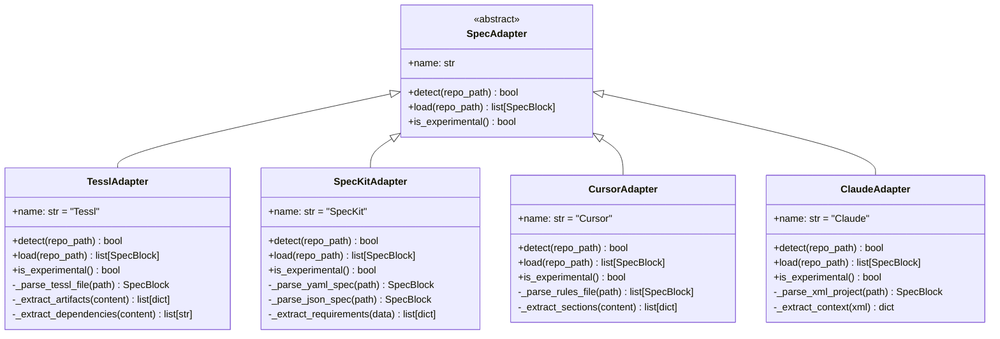

# Spec-Driven Adapters Design Document

## Overview

This design adds experimental support for modern spec-driven development frameworks like Tessl, SpecKit, Cursor, and Claude. These adapters extend SpecMem's capability beyond traditional documentation to include executable specifications, AI-generated artifacts, and structured requirements from AI-first development platforms.

## Architecture



## Components and Interfaces

### Base Adapter Extension

Add experimental adapter support to the base class:

```python
class SpecAdapter(ABC):
    """Base interface for all spec framework adapters."""

    def is_experimental(self) -> bool:
        """Check if this adapter is experimental.

        Returns:
            True if adapter is experimental and may have limited functionality
        """
        return False

    def warn_if_experimental(self) -> None:
        """Issue warning if adapter is experimental."""
        if self.is_experimental():
            import warnings
            warnings.warn(
                f"Adapter '{self.name}' is experimental and may have "
                f"limited functionality or breaking changes.",
                ExperimentalAdapterWarning,
                stacklevel=3
            )
```

### TesslAdapter

Handles Tessl AI-first development specifications:

```python
class TesslAdapter(SpecAdapter):
    """Experimental adapter for Tessl specifications.

    Detects and parses:
    - .tessl specification files
    - .spec.ts/.spec.js executable specifications
    - tessl.config.* configuration files
    - tessl.yaml/tessl.json manifests
    """

    FILE_PATTERNS = [
        "**/*.tessl",
        "**/*.spec.ts",
        "**/*.spec.js",
        "**/tessl.config.*",
        "**/tessl.yaml",
        "**/tessl.json"
    ]
```

### SpecKitAdapter

Handles GitHub SpecKit (https://github.com/github/spec-kit) specifications:

```python
class SpecKitAdapter(SpecAdapter):
    """Experimental adapter for GitHub SpecKit specifications.

    Detects and parses:
    - .specify/specs/*/spec.md - Feature specifications with user stories
    - .specify/specs/*/plan.md - Implementation plans with technical context
    - .specify/specs/*/tasks.md - Task breakdowns by user story
    - .specify/memory/constitution.md - Project governing principles
    """

    # Detects .specify/ directory structure
```

### CursorAdapter

Handles Cursor AI assistant rules:

```python
class CursorAdapter(SpecAdapter):
    """Experimental adapter for Cursor rules.

    Detects and parses:
    - .cursorrules files
    - cursor.rules files
    """

    FILE_PATTERNS = [
        "**/.cursorrules",
        "**/cursor.rules"
    ]
```

### ClaudeAdapter

Handles Claude AI project files:

```python
class ClaudeAdapter(SpecAdapter):
    """Experimental adapter for Claude project files.

    Detects and parses:
    - claude_project.xml files
    - .claude/**/*.xml files
    """

    FILE_PATTERNS = [
        "**/claude_project.xml",
        "**/.claude/**/*.xml",
        "**/project.claude"
    ]
```

## Data Models

### Tessl Specification Format

```python
@dataclass
class TesslSpec:
    """Tessl specification structure."""
    name: str
    description: str
    requirements: list[str]
    constraints: list[str]
    dependencies: list[str]
    artifacts: list[dict]  # AI-generated artifacts
    metadata: dict[str, Any]
```

### GitHub SpecKit Specification Format

GitHub SpecKit uses a directory-based structure:

```text
.specify/
├── memory/
│   └── constitution.md      # Project principles
├── specs/
│   └── 001-feature-name/
│       ├── spec.md          # User stories, requirements, success criteria
│       ├── plan.md          # Technical context, project structure
│       ├── tasks.md         # Task breakdown by user story
│       └── research.md      # Technical research findings
└── templates/
    └── *.md                 # Specification templates
```

## File Pattern Detection

### Detection Strategy

Each adapter uses glob patterns to detect relevant files:

```python
def detect(self, repo_path: str) -> bool:
    """Check if adapter's framework is present."""
    path = Path(repo_path)
    for pattern in self.FILE_PATTERNS:
        if list(path.glob(pattern)):
            return True
    return False
```

## Correctness Properties

*A property is a characteristic or behavior that should hold true across all valid executions of a system-essentially, a formal statement about what the system should do. Properties serve as the bridge between human-readable specifications and machine-verifiable correctness guarantees.*

### Property 1: File Pattern Detection Completeness

*For any* directory containing files matching an adapter's patterns, the adapter's `detect()` method SHALL return True.

**Validates: Requirements 1.1, 2.1, 4.1, 5.1**

### Property 2: Parsing Completeness

*For any* valid specification file, parsing SHALL extract all required components (text, metadata, relationships) without data loss.

**Validates: Requirements 1.2, 2.2, 4.2, 5.2**

### Property 3: Metadata Preservation

*For any* specification containing metadata, the metadata SHALL be preserved in the resulting SpecBlock tags or links.

**Validates: Requirements 1.4, 2.3, 2.4, 4.3, 5.3**

### Property 4: Experimental Adapter Marking

*For any* experimental adapter, the `is_experimental()` method SHALL return True.

**Validates: Requirements 3.1**

### Property 5: Graceful Error Handling

*For any* malformed or unsupported specification content, the adapter SHALL log a warning and continue processing remaining files.

**Validates: Requirements 3.3, 3.4**

### Property 6: Configuration Fallback

*For any* invalid custom configuration, the adapter SHALL fall back to default patterns and continue processing.

**Validates: Requirements 6.2**

## Error Handling

### Experimental Adapter Warnings

```python
class ExperimentalAdapterWarning(UserWarning):
    """Warning for experimental adapter usage."""
    pass

def warn_experimental_usage(adapter_name: str) -> None:
    warnings.warn(
        f"Adapter '{adapter_name}' is experimental and may have limited "
        f"functionality or breaking changes in future versions.",
        ExperimentalAdapterWarning,
        stacklevel=2
    )
```

### Graceful Degradation

```python
def load(self, repo_path: str) -> list[SpecBlock]:
    """Load specs with graceful error handling."""
    self.warn_if_experimental()
    blocks = []

    for file_path in self._find_spec_files(repo_path):
        try:
            block = self._parse_file(file_path)
            if block:
                blocks.append(block)
        except Exception as e:
            logger.warning(f"Failed to parse {file_path}: {e}")
            # Continue processing other files

    return blocks
```

## Testing Strategy

### Property-Based Testing

Use **Hypothesis** for property-based testing:

```python
from hypothesis import given, strategies as st

# File pattern generators
tessl_file_strategy = st.sampled_from([
    "app.tessl", "component.spec.ts", "tessl.config.js"
])

speckit_file_strategy = st.sampled_from([
    "requirements.speckit", "api.spec.yaml", "speckit.config.json"
])

cursor_file_strategy = st.sampled_from([
    ".cursorrules", "cursor.rules"
])

claude_file_strategy = st.sampled_from([
    "claude_project.xml", ".claude/context.xml"
])
```

### Unit Testing

- Test each adapter's `detect()` method with various directory structures
- Test parsing of valid and invalid specification files
- Test experimental warning behavior
- Test error handling and graceful degradation

### Integration Testing

- Test adapter registration and discovery
- Test loading specs from real-world examples
- Test interaction with MemoryBank
