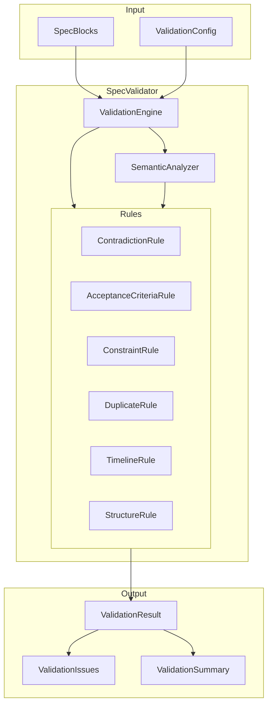

# Design Document: SpecValidator

## Overview

SpecValidator is a specification quality assurance system that validates specifications for correctness, completeness, and consistency. It provides a rule-based validation engine that can detect contradictions, missing acceptance criteria, invalid constraints, duplicate features, and impossible timelines. The system integrates with the CLI and SpecMemClient for seamless developer and agent workflows.

## Architecture



## Components and Interfaces

### ValidationRule (Abstract Base)

```python
from abc import ABC, abstractmethod
from dataclasses import dataclass
from enum import Enum
from typing import Any

class IssueSeverity(str, Enum):
    ERROR = "error"
    WARNING = "warning"
    INFO = "info"

@dataclass
class ValidationIssue:
    rule_id: str
    severity: IssueSeverity
    message: str
    spec_id: str
    file_path: str | None = None
    line_number: int | None = None
    context: dict[str, Any] | None = None
    suggestion: str | None = None

class ValidationRule(ABC):
    """Base class for validation rules."""

    rule_id: str
    name: str
    description: str
    default_severity: IssueSeverity

    @abstractmethod
    def validate(
        self,
        specs: list[SpecBlock],
        config: ValidationConfig,
    ) -> list[ValidationIssue]:
        """Run validation and return issues found."""
        pass

    def is_enabled(self, config: ValidationConfig) -> bool:
        """Check if this rule is enabled in config."""
        return config.is_rule_enabled(self.rule_id)
```

### ValidationEngine

```python
@dataclass
class ValidationResult:
    """Result of running validation."""

    issues: list[ValidationIssue]
    specs_validated: int
    rules_run: int
    duration_ms: float

    @property
    def is_valid(self) -> bool:
        """True if no errors found."""
        return not any(i.severity == IssueSeverity.ERROR for i in self.issues)

    @property
    def error_count(self) -> int:
        return sum(1 for i in self.issues if i.severity == IssueSeverity.ERROR)

    @property
    def warning_count(self) -> int:
        return sum(1 for i in self.issues if i.severity == IssueSeverity.WARNING)

    @property
    def info_count(self) -> int:
        return sum(1 for i in self.issues if i.severity == IssueSeverity.INFO)

    def get_by_severity(self, severity: IssueSeverity) -> list[ValidationIssue]:
        return [i for i in self.issues if i.severity == severity]

    def get_by_spec(self, spec_id: str) -> list[ValidationIssue]:
        return [i for i in self.issues if i.spec_id == spec_id]

class ValidationEngine:
    """Main validation engine."""

    def __init__(self, config: ValidationConfig | None = None):
        self.config = config or ValidationConfig()
        self.rules: list[ValidationRule] = []
        self._register_default_rules()

    def register_rule(self, rule: ValidationRule) -> None:
        """Register a validation rule."""
        self.rules.append(rule)

    def validate(
        self,
        specs: list[SpecBlock],
        spec_ids: list[str] | None = None,
    ) -> ValidationResult:
        """Validate specs and return results."""
        pass
```

### Validation Rules

```python
class ContradictionRule(ValidationRule):
    """Detect contradictory requirements."""

    rule_id = "contradiction"
    name = "Contradiction Detection"
    description = "Finds requirements that contradict each other"
    default_severity = IssueSeverity.ERROR

    NEGATION_PATTERNS = [
        ("shall", "shall not"),
        ("must", "must not"),
        ("will", "will not"),
        ("can", "cannot"),
    ]

class AcceptanceCriteriaRule(ValidationRule):
    """Validate acceptance criteria completeness."""

    rule_id = "acceptance_criteria"
    name = "Acceptance Criteria Validation"
    description = "Ensures requirements have proper acceptance criteria"
    default_severity = IssueSeverity.ERROR

    EARS_PATTERNS = [
        r"WHEN .+ THEN .+ SHALL",
        r"WHILE .+ THE .+ SHALL",
        r"IF .+ THEN .+ SHALL",
        r"WHERE .+ THE .+ SHALL",
        r"THE .+ SHALL",
    ]

class ConstraintRule(ValidationRule):
    """Detect invalid constraints."""

    rule_id = "constraints"
    name = "Constraint Validation"
    description = "Finds impossible or invalid constraints"
    default_severity = IssueSeverity.ERROR

class DuplicateRule(ValidationRule):
    """Detect duplicate or similar specs."""

    rule_id = "duplicates"
    name = "Duplicate Detection"
    description = "Finds semantically similar specifications"
    default_severity = IssueSeverity.WARNING

    DEFAULT_THRESHOLD = 0.85

class TimelineRule(ValidationRule):
    """Validate timeline constraints."""

    rule_id = "timelines"
    name = "Timeline Validation"
    description = "Finds impossible or conflicting timelines"
    default_severity = IssueSeverity.ERROR

class StructureRule(ValidationRule):
    """Validate spec structure and formatting."""

    rule_id = "structure"
    name = "Structure Validation"
    description = "Ensures specs follow required structure"
    default_severity = IssueSeverity.WARNING

    REQUIRED_SECTIONS = ["Introduction", "Glossary", "Requirements"]
```

### ValidationConfig

```python
@dataclass
class RuleConfig:
    enabled: bool = True
    severity: IssueSeverity | None = None
    options: dict[str, Any] = field(default_factory=dict)

@dataclass
class ValidationConfig:
    """Configuration for validation."""

    rules: dict[str, RuleConfig] = field(default_factory=dict)
    similarity_threshold: float = 0.85
    min_acceptance_criteria: int = 2
    max_spec_length: int = 5000

    def is_rule_enabled(self, rule_id: str) -> bool:
        if rule_id not in self.rules:
            return True  # Enabled by default
        return self.rules[rule_id].enabled

    def get_severity(
        self,
        rule_id: str,
        default: IssueSeverity,
    ) -> IssueSeverity:
        if rule_id in self.rules and self.rules[rule_id].severity:
            return self.rules[rule_id].severity
        return default

    @classmethod
    def from_toml(cls, config: dict[str, Any]) -> ValidationConfig:
        """Load from .specmem.toml validation section."""
        pass
```

## Data Models

### Core Models

```python
@dataclass
class Contradiction:
    """A detected contradiction between specs."""

    spec_id_1: str
    spec_id_2: str
    text_1: str
    text_2: str
    conflict_type: str
    explanation: str

@dataclass
class DuplicatePair:
    """A pair of potentially duplicate specs."""

    spec_id_1: str
    spec_id_2: str
    similarity_score: float
    matching_sections: list[str]

@dataclass
class TimelineConflict:
    """A timeline conflict between specs."""

    spec_id: str
    deadline: datetime | None
    dependency_spec_id: str | None
    dependency_deadline: datetime | None
    conflict_type: str
```

## Correctness Properties

*A property is a characteristic or behavior that should hold true across all valid executions of a system-essentially, a formal statement about what the system should do. Properties serve as the bridge between human-readable specifications and machine-verifiable correctness guarantees.*

### Property 1: Contradiction Detection Completeness
*For any* pair of requirements with negation patterns (SHALL vs SHALL NOT) on the same subject, the validator SHALL detect and report the contradiction with both spec IDs.
**Validates: Requirements 1.1, 1.2, 1.4**

### Property 2: Acceptance Criteria Completeness
*For any* requirement without acceptance criteria or with fewer than the configured minimum, the validator SHALL report an issue.
**Validates: Requirements 2.1, 2.4**

### Property 3: Invalid Constraint Detection
*For any* constraint with impossible values (negative counts, percentages >100%, negative time, min > max), the validator SHALL report an error.
**Validates: Requirements 3.1, 3.2, 3.3**

### Property 4: Duplicate Detection with Similarity
*For any* pair of specs with semantic similarity above the configured threshold, the validator SHALL report them as potential duplicates with a similarity score in [0.0, 1.0].
**Validates: Requirements 4.1, 4.2, 4.3**

### Property 5: ID Uniqueness
*For any* set of specs with duplicate IDs, the validator SHALL report an error for each duplicate.
**Validates: Requirements 4.4**

### Property 6: Timeline Consistency
*For any* deadline in the past or task deadline that precedes its dependency's deadline, the validator SHALL report an error.
**Validates: Requirements 5.1, 5.2, 5.3**

### Property 7: Structure Validation
*For any* spec missing required sections or with invalid cross-references, the validator SHALL report an issue.
**Validates: Requirements 6.1, 6.4**

### Property 8: Result Completeness
*For any* validation run, the result SHALL include all issues with spec_id, severity, and message; and the summary counts SHALL match the actual issue counts.
**Validates: Requirements 7.1, 7.2, 7.3, 7.4**

### Property 9: Valid Specs Pass
*For any* well-formed spec with no issues, the validator SHALL return a result with zero issues and is_valid=True.
**Validates: Requirements 7.5**

### Property 10: Configuration Respect
*For any* disabled rule in config, the validator SHALL not run that rule; and custom severity levels SHALL be applied to issues.
**Validates: Requirements 9.2, 9.3, 9.4**

### Property 11: CLI Exit Code
*For any* validation with errors, the CLI SHALL exit with non-zero status.
**Validates: Requirements 8.3**

### Property 12: Client API Correctness
*For any* call to client.validate(), the result SHALL be a ValidationResult with proper filtering methods.
**Validates: Requirements 10.1, 10.2, 10.4**

## Error Handling

- **Invalid Config**: Return default config with warning
- **Parse Errors**: Report as structure validation issues
- **Missing Specs**: Skip with warning, continue validation
- **Rule Exceptions**: Catch, log, and continue with other rules
- **Timeout**: Configurable timeout per rule, skip slow rules

## Testing Strategy

### Unit Tests
- Test each validation rule in isolation
- Test ValidationResult methods
- Test config loading and defaults

### Property-Based Tests
- Use Hypothesis to generate specs with known issues
- Verify detection rates for each rule type
- Test edge cases with generated data

### Integration Tests
- Test CLI commands with real spec files
- Test SpecMemClient integration
- Test config file loading

### Test Framework
- pytest for test execution
- Hypothesis for property-based testing
- pytest-mock for mocking dependencies
