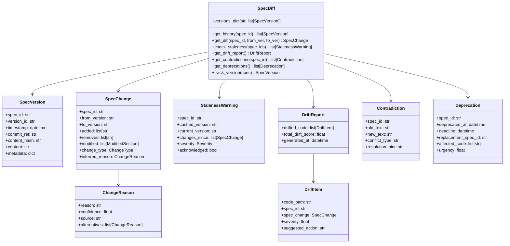

# SpecDiff Design Document

## Overview

SpecDiff is a temporal intelligence system that tracks specification evolution over time. It provides "git blame for requirements" - enabling agents and developers to understand what changed, why it changed, and what code is now invalid due to spec drift. SpecDiff integrates with the existing SpecImpact graph to identify affected code and detect staleness.

## Architecture



## Components and Interfaces

### SpecVersion

Represents a snapshot of a specification at a point in time:

```python
@dataclass
class SpecVersion:
    """A version of a specification."""

    spec_id: str              # Spec identifier
    version_id: str           # Version identifier (commit hash or timestamp)
    timestamp: datetime       # When this version was created
    commit_ref: str | None    # Git commit reference
    content_hash: str         # Hash of content for quick comparison
    content: str              # Full spec content
    metadata: dict = field(default_factory=dict)

    def to_dict(self) -> dict:
        """Serialize to dictionary."""

    @classmethod
    def from_dict(cls, data: dict) -> "SpecVersion":
        """Deserialize from dictionary."""
```

### SpecChange

Represents changes between two spec versions:

```python
@dataclass
class SpecChange:
    """Changes between two spec versions."""

    spec_id: str
    from_version: str
    to_version: str
    timestamp: datetime
    added: list[str]           # Added lines/sections
    removed: list[str]         # Removed lines/sections
    modified: list[ModifiedSection]  # Modified sections
    change_type: ChangeType    # SEMANTIC, COSMETIC, BREAKING
    inferred_reason: ChangeReason | None

    def is_breaking(self) -> bool:
        """Check if this is a breaking change."""

    def to_dict(self) -> dict:
        """Serialize to dictionary."""
```

### ChangeReason

Inferred reason for a spec change:

```python
@dataclass
class ChangeReason:
    """Inferred reason for a spec change."""

    reason: str               # Human-readable reason
    confidence: float         # Confidence score 0.0-1.0
    source: str               # Where reason was inferred from
    alternatives: list["ChangeReason"] = field(default_factory=list)

    def to_dict(self) -> dict:
        """Serialize to dictionary."""
```


### StalenessWarning

Warning when an agent accesses stale spec data:

```python
@dataclass
class StalenessWarning:
    """Warning about stale spec memory."""

    spec_id: str
    cached_version: str       # Version the agent has
    current_version: str      # Latest version
    changes_since: list[SpecChange]  # What changed
    severity: Severity        # LOW, MEDIUM, HIGH, CRITICAL
    acknowledged: bool = False
    acknowledged_at: datetime | None = None

    def to_dict(self) -> dict:
        """Serialize to dictionary."""
```

### DriftReport and DriftItem

Report on code that has drifted from specs:

```python
@dataclass
class DriftItem:
    """A piece of code that has drifted from its spec."""

    code_path: str            # Path to drifted code
    spec_id: str              # Spec it implements
    spec_change: SpecChange   # The change causing drift
    severity: float           # Drift severity 0.0-1.0
    suggested_action: str     # What to do about it

    def to_dict(self) -> dict:
        """Serialize to dictionary."""

@dataclass
class DriftReport:
    """Complete drift analysis report."""

    drifted_code: list[DriftItem]
    total_drift_score: float  # Aggregate drift severity
    generated_at: datetime

    def to_dict(self) -> dict:
        """Serialize to dictionary."""

    def get_by_severity(self, min_severity: float) -> list[DriftItem]:
        """Get drift items above severity threshold."""
```

### Deprecation

Tracks deprecated specifications:

```python
@dataclass
class Deprecation:
    """A deprecated specification."""

    spec_id: str
    deprecated_at: datetime
    deadline: datetime | None  # When it must be migrated
    replacement_spec_id: str | None  # What replaces it
    affected_code: list[str]  # Code that needs migration
    urgency: float            # Urgency score 0.0-1.0

    def days_remaining(self) -> int | None:
        """Calculate days until deadline."""

    def to_dict(self) -> dict:
        """Serialize to dictionary."""
```

### SpecDiff (Main Class)

```python
class SpecDiff:
    """Temporal spec intelligence system."""

    def __init__(
        self,
        storage_path: Path,
        impact_graph: SpecImpactGraph | None = None,
    ) -> None:
        """Initialize SpecDiff."""

    def get_history(
        self,
        spec_id: str,
        limit: int | None = None,
    ) -> list[SpecVersion]:
        """Get version history for a spec, chronologically ordered."""

    def get_diff(
        self,
        spec_id: str,
        from_version: str | None = None,
        to_version: str | None = None,
    ) -> SpecChange:
        """Get diff between two versions."""

    def check_staleness(
        self,
        spec_ids: list[str],
        cached_versions: dict[str, str] | None = None,
    ) -> list[StalenessWarning]:
        """Check if specs are stale."""

    def get_drift_report(
        self,
        since: datetime | None = None,
    ) -> DriftReport:
        """Get report on code drift from specs."""

    def get_contradictions(
        self,
        spec_id: str,
    ) -> list[Contradiction]:
        """Find contradictions in spec history."""

    def get_deprecations(
        self,
        include_expired: bool = False,
    ) -> list[Deprecation]:
        """Get deprecated specs sorted by urgency."""

    def track_version(
        self,
        spec: SpecBlock,
        commit_ref: str | None = None,
    ) -> SpecVersion:
        """Track a new version of a spec."""

    def acknowledge_staleness(
        self,
        spec_id: str,
        version: str,
    ) -> bool:
        """Acknowledge a staleness warning."""

    def prune_history(
        self,
        older_than: datetime,
        keep_min: int = 10,
    ) -> int:
        """Prune old versions, keeping at least keep_min."""
```

## Data Models

### ChangeType

```python
class ChangeType(str, Enum):
    """Type of spec change."""

    SEMANTIC = "semantic"      # Meaning changed
    COSMETIC = "cosmetic"      # Formatting only
    BREAKING = "breaking"      # Breaking change
    ADDITION = "addition"      # New content added
    REMOVAL = "removal"        # Content removed
```

### Severity

```python
class Severity(str, Enum):
    """Severity level for warnings."""

    LOW = "low"
    MEDIUM = "medium"
    HIGH = "high"
    CRITICAL = "critical"
```

## Storage

SpecDiff stores version history in a SQLite database:

```sql
CREATE TABLE spec_versions (
    id INTEGER PRIMARY KEY,
    spec_id TEXT NOT NULL,
    version_id TEXT NOT NULL,
    timestamp DATETIME NOT NULL,
    commit_ref TEXT,
    content_hash TEXT NOT NULL,
    content TEXT NOT NULL,
    metadata TEXT,  -- JSON
    UNIQUE(spec_id, version_id)
);

CREATE TABLE staleness_acks (
    id INTEGER PRIMARY KEY,
    spec_id TEXT NOT NULL,
    version_id TEXT NOT NULL,
    acknowledged_at DATETIME NOT NULL,
    UNIQUE(spec_id, version_id)
);

CREATE TABLE deprecations (
    id INTEGER PRIMARY KEY,
    spec_id TEXT NOT NULL UNIQUE,
    deprecated_at DATETIME NOT NULL,
    deadline DATETIME,
    replacement_spec_id TEXT,
    metadata TEXT  -- JSON
);

CREATE INDEX idx_versions_spec ON spec_versions(spec_id);
CREATE INDEX idx_versions_timestamp ON spec_versions(timestamp);
```

## Correctness Properties

*A property is a characteristic or behavior that should hold true across all valid executions of a system-essentially, a formal statement about what the system should do. Properties serve as the bridge between human-readable specifications and machine-verifiable correctness guarantees.*

### Property 1: Version History Chronological Order

*For any* spec with multiple versions, `get_history()` SHALL return versions ordered by timestamp ascending (oldest first).

**Validates: Requirements 1.1**

### Property 2: Diff Completeness

*For any* two spec versions A and B, the diff SHALL capture all textual differences such that applying the diff to A produces B.

**Validates: Requirements 1.2**

### Property 3: Change Metadata Completeness

*For any* SpecChange, it SHALL include a valid timestamp and commit reference (or null if git unavailable).

**Validates: Requirements 1.3**

### Property 4: Change Reason Confidence Range

*For any* ChangeReason, the confidence score SHALL be between 0.0 and 1.0.

**Validates: Requirements 2.4**

### Property 5: Change Reasons Ordered by Confidence

*For any* ChangeReason with alternatives, the alternatives SHALL be ordered by confidence descending.

**Validates: Requirements 2.5**

### Property 6: Drift Detection Completeness

*For any* spec change, all code linked to that spec via the impact graph SHALL be included in the drift report.

**Validates: Requirements 3.1**

### Property 7: Drift Severity Range

*For any* DriftItem, the severity score SHALL be between 0.0 and 1.0.

**Validates: Requirements 3.2**

### Property 8: Drift References Spec Change

*For any* DriftItem, it SHALL reference the specific SpecChange that caused the drift.

**Validates: Requirements 3.3**

### Property 9: Staleness Detection Accuracy

*For any* spec access with a cached version older than current, a StalenessWarning SHALL be generated.

**Validates: Requirements 4.1, 4.2**

### Property 10: Staleness Warning Includes Diff

*For any* StalenessWarning, it SHALL include the list of changes since the cached version.

**Validates: Requirements 4.3**

### Property 11: Critical Staleness for Breaking Changes

*For any* staleness involving a BREAKING change, the severity SHALL be CRITICAL.

**Validates: Requirements 4.4**

### Property 12: Acknowledgment Persistence

*For any* acknowledged staleness, subsequent staleness checks SHALL reflect the acknowledgment.

**Validates: Requirements 4.5**

### Property 13: Contradiction Includes Both Versions

*For any* Contradiction, it SHALL include both the old and new conflicting text.

**Validates: Requirements 5.2, 5.3**

### Property 14: Deprecation Date Tracking

*For any* deprecated spec, the Deprecation SHALL include the deprecation date.

**Validates: Requirements 6.1**

### Property 15: Deprecation Urgency Ordering

*For any* list of deprecations, they SHALL be ordered by urgency descending.

**Validates: Requirements 6.5**

### Property 16: Version Auto-Creation

*For any* spec modification, a new SpecVersion SHALL be created with unique version_id.

**Validates: Requirements 9.1**

### Property 17: Git Commit as Version ID

*For any* version created when git is available, the version_id SHALL be the git commit hash.

**Validates: Requirements 9.2**

### Property 18: History Pruning Preserves Minimum

*For any* prune operation with keep_min=N, at least N versions SHALL remain for each spec.

**Validates: Requirements 9.5**

## Error Handling

```python
class SpecDiffError(SpecMemError):
    """Base error for SpecDiff operations."""
    pass

class VersionNotFoundError(SpecDiffError):
    """Requested version does not exist."""
    pass

class NoHistoryError(SpecDiffError):
    """Spec has no version history."""
    pass

class DiffError(SpecDiffError):
    """Error computing diff between versions."""
    pass
```

## Testing Strategy

### Property-Based Testing

Use **Hypothesis** for property-based testing:

```python
from hypothesis import given, strategies as st

# Version strategy
version_strategy = st.builds(
    SpecVersion,
    spec_id=st.text(min_size=1, max_size=50),
    version_id=st.text(min_size=1, max_size=40),
    timestamp=st.datetimes(),
    content=st.text(min_size=1, max_size=1000),
)

# Change reason strategy
reason_strategy = st.builds(
    ChangeReason,
    reason=st.text(min_size=1, max_size=200),
    confidence=st.floats(min_value=0.0, max_value=1.0),
    source=st.text(min_size=1, max_size=50),
)
```

### Unit Testing

- Test version tracking and retrieval
- Test diff computation
- Test staleness detection
- Test deprecation tracking
- Test CLI commands

### Integration Testing

- Test with real git repository
- Test with SpecImpact graph integration
- Test end-to-end drift detection
