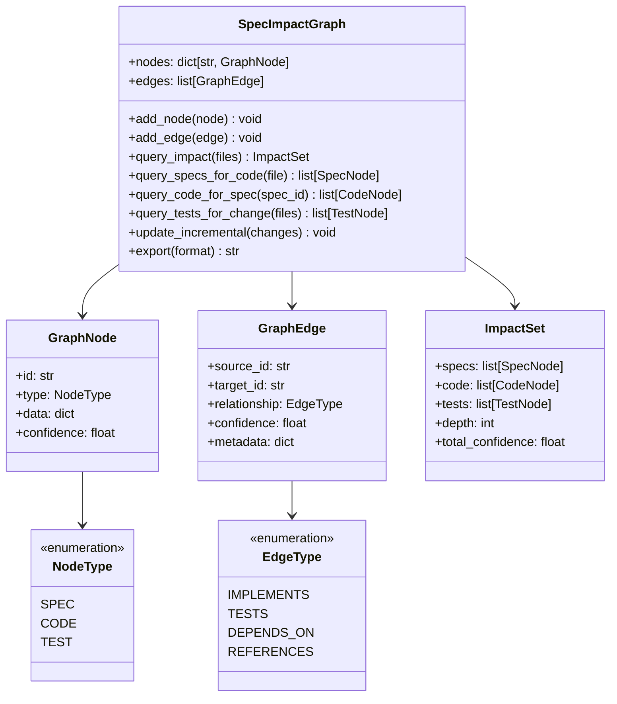

# SpecImpact Graph Design Document

## Overview

The SpecImpact Graph is a bidirectional relationship graph that connects specifications, code files, and tests. It enables SpecMem to answer "If this file changed, which specs and tests matter?" - the core question for selective testing and context-aware agents.

## Architecture



## Components and Interfaces

### GraphNode

Represents a node in the impact graph:

```python
@dataclass
class GraphNode:
    """Node in the SpecImpact graph."""

    id: str                    # Unique node ID
    type: NodeType             # SPEC, CODE, or TEST
    data: dict                 # Node-specific data
    confidence: float = 1.0    # Node confidence (for suggested links)
    suggested: bool = False    # True if auto-discovered below threshold

    def to_dict(self) -> dict:
        """Serialize to dictionary."""
```

### GraphEdge

Represents a relationship between nodes:

```python
@dataclass
class GraphEdge:
    """Edge connecting two nodes in the graph."""

    source_id: str             # Source node ID
    target_id: str             # Target node ID
    relationship: EdgeType     # Type of relationship
    confidence: float = 1.0    # Relationship confidence
    metadata: dict = field(default_factory=dict)
    manual: bool = False       # True if manually defined

    def to_dict(self) -> dict:
        """Serialize to dictionary."""
```

### ImpactSet

Result of impact analysis:

```python
@dataclass
class ImpactSet:
    """Complete impact set for a change."""

    specs: list[GraphNode]     # Affected specifications
    code: list[GraphNode]      # Related code files
    tests: list[GraphNode]     # Tests to run
    changed_files: list[str]   # Input files
    depth: int                 # Traversal depth used
    message: str = ""          # Status message

    def to_dict(self) -> dict:
        """Serialize to dictionary."""

    def get_test_commands(self) -> dict[str, list[str]]:
        """Get test commands grouped by framework."""
```

### SpecImpactGraph

Main graph class:

```python
class SpecImpactGraph:
    """Bidirectional relationship graph for spec impact analysis."""

    def __init__(self, storage_path: Path) -> None:
        """Initialize graph with storage path."""

    def add_node(self, node: GraphNode) -> None:
        """Add a node to the graph."""

    def add_edge(self, edge: GraphEdge) -> None:
        """Add an edge to the graph."""

    def query_impact(
        self,
        changed_files: list[str],
        depth: int = 2,
        include_suggested: bool = False,
    ) -> ImpactSet:
        """Get full impact set for changed files."""

    def query_specs_for_code(
        self,
        file_path: str,
        include_transitive: bool = True,
    ) -> list[GraphNode]:
        """Get specs linked to a code file."""

    def query_code_for_spec(
        self,
        spec_id: str,
    ) -> list[GraphNode]:
        """Get code files implementing a spec."""

    def query_tests_for_change(
        self,
        changed_files: list[str],
    ) -> list[GraphNode]:
        """Get tests to run for changed files."""

    def update_incremental(
        self,
        changed_specs: list[str] = None,
        changed_code: list[str] = None,
    ) -> None:
        """Update graph incrementally for changes."""

    def export(
        self,
        format: str = "json",
        filter_type: NodeType = None,
        focal_node: str = None,
        max_depth: int = None,
    ) -> str:
        """Export graph in specified format."""

    def get_stats(self) -> dict:
        """Get graph statistics."""
```

### GraphBuilder

Builds the graph from specs and code:

```python
class GraphBuilder:
    """Builds SpecImpact graph from specs and code analysis."""

    def __init__(
        self,
        workspace_path: Path,
        confidence_threshold: float = 0.5,
    ) -> None:
        """Initialize builder."""

    def build(
        self,
        specs: list[SpecBlock],
        code_analyzer: CodeAnalyzer,
        test_engine: TestMappingEngine,
    ) -> SpecImpactGraph:
        """Build complete graph from specs and code."""

    def analyze_code_links(
        self,
        code_file: Path,
        specs: list[SpecBlock],
    ) -> list[GraphEdge]:
        """Analyze code file for spec links."""

    def analyze_test_links(
        self,
        test_mappings: list[TestMapping],
        specs: list[SpecBlock],
    ) -> list[GraphEdge]:
        """Link tests to specs."""
```

## Data Models

### NodeType

```python
class NodeType(str, Enum):
    """Types of nodes in the graph."""

    SPEC = "spec"
    CODE = "code"
    TEST = "test"
```

### EdgeType

```python
class EdgeType(str, Enum):
    """Types of relationships between nodes."""

    IMPLEMENTS = "implements"    # Code implements spec
    TESTS = "tests"              # Test validates spec
    DEPENDS_ON = "depends_on"    # Code depends on code
    REFERENCES = "references"    # Spec references spec
```

## Correctness Properties

*A property is a characteristic or behavior that should hold true across all valid executions of a system-essentially, a formal statement about what the system should do. Properties serve as the bridge between human-readable specifications and machine-verifiable correctness guarantees.*

### Property 1: Spec Query Completeness

*For any* code file with linked specs, querying specs for that file SHALL return all directly linked specs.

**Validates: Requirements 1.1**

### Property 2: Transitive Closure

*For any* graph with path A→B→C, querying impact for A with depth≥2 SHALL include C in results.

**Validates: Requirements 1.3**

### Property 3: Confidence Inclusion

*For any* returned node in an impact query, the result SHALL include a confidence score between 0.0 and 1.0.

**Validates: Requirements 1.2, 2.2, 3.2**

### Property 4: Test Ordering

*For any* list of tests returned from impact query, tests SHALL be ordered by confidence descending.

**Validates: Requirements 2.3**

### Property 5: Bidirectional Query

*For any* edge A→B in the graph, querying from A SHALL find B, and querying from B SHALL find A.

**Validates: Requirements 1.1, 3.1**

### Property 6: Incremental Preservation

*For any* incremental update affecting node X, all nodes not connected to X SHALL remain unchanged.

**Validates: Requirements 4.3**

### Property 7: Impact Set Completeness

*For any* impact query, the result SHALL contain specs, code, and tests lists (possibly empty).

**Validates: Requirements 5.1**

### Property 8: Depth Limiting

*For any* impact query with depth=N, no returned node SHALL be more than N edges from input nodes.

**Validates: Requirements 5.2**

### Property 9: Export Format Validity

*For any* graph export in JSON format, the output SHALL be valid JSON parseable back to graph structure.

**Validates: Requirements 6.1, 6.2**

### Property 10: Suggested Link Marking

*For any* auto-discovered link with confidence below threshold, the edge SHALL be marked as suggested=True.

**Validates: Requirements 7.3**

### Property 11: Manual Link Priority

*For any* node with both manual and auto-discovered links, manual links SHALL have higher effective confidence.

**Validates: Requirements 7.4**

## Error Handling

```python
class GraphError(SpecMemError):
    """Base error for graph operations."""
    pass

class NodeNotFoundError(GraphError):
    """Node not found in graph."""
    pass

class CycleDetectedError(GraphError):
    """Cycle detected during traversal."""
    pass

class GraphCorruptionError(GraphError):
    """Graph data is corrupted."""
    pass
```

## Testing Strategy

### Property-Based Testing

Use **Hypothesis** for property-based testing:

```python
from hypothesis import given, strategies as st

# Node strategy
node_strategy = st.builds(
    GraphNode,
    id=st.text(min_size=1, max_size=50),
    type=st.sampled_from(list(NodeType)),
    confidence=st.floats(min_value=0.0, max_value=1.0),
)

# Edge strategy
edge_strategy = st.builds(
    GraphEdge,
    source_id=st.text(min_size=1, max_size=50),
    target_id=st.text(min_size=1, max_size=50),
    relationship=st.sampled_from(list(EdgeType)),
    confidence=st.floats(min_value=0.0, max_value=1.0),
)
```

### Unit Testing

- Test graph construction and persistence
- Test traversal algorithms
- Test export formats
- Test incremental updates

### Integration Testing

- Test with real codebase
- Test CLI commands
- Test with SpecMemClient integration
