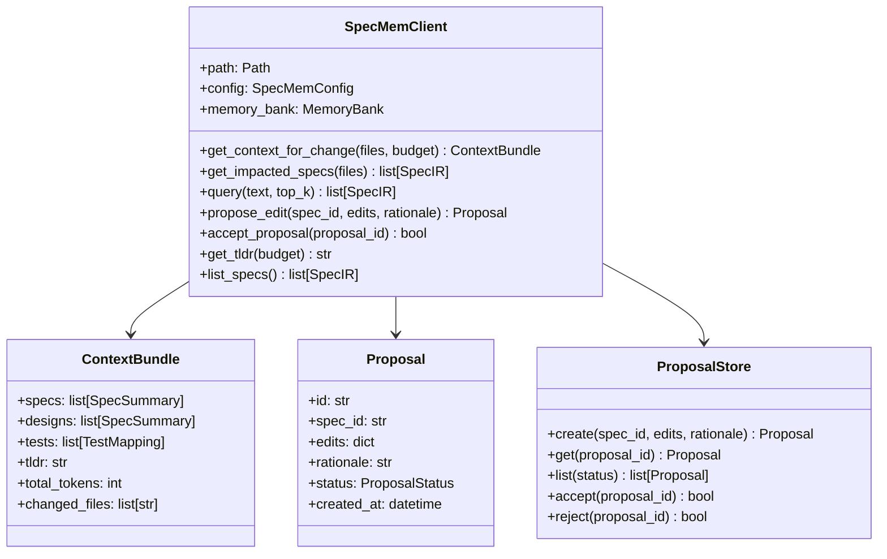

# SpecMemClient API Design Document

## Overview

The SpecMemClient provides a Python API for coding agents to interact with SpecMem programmatically. It wraps the core SpecMem functionality (memory bank, context optimization, impact analysis) into a simple, agent-friendly interface that enables the AgentEx (Agent Experience) vision.

## Architecture



## Components and Interfaces

### SpecMemClient

The main client class for agent interaction:

```python
class SpecMemClient:
    """Python client for SpecMem agent integration.

    Provides a simple API for coding agents to:
    - Get context bundles for code changes
    - Query impacted specifications
    - Propose and manage spec edits
    - Access TL;DR summaries

    Example:
        from specmem import SpecMemClient

        sm = SpecMemClient()
        bundle = sm.get_context_for_change(["auth/service.py"])
        print(bundle.tldr)
    """

    def __init__(
        self,
        path: str | Path = ".",
        config_path: str | Path | None = None,
    ) -> None:
        """Initialize the client."""

    def get_context_for_change(
        self,
        changed_files: list[str],
        token_budget: int = 4000,
        format: str = "json",
    ) -> ContextBundle:
        """Get optimized context bundle for changed files."""

    def get_impacted_specs(
        self,
        changed_files: list[str] | None = None,
        git_diff: str | None = None,
    ) -> list[SpecBlock]:
        """Get specs impacted by code changes."""

    def query(
        self,
        text: str,
        top_k: int = 10,
        include_legacy: bool = False,
    ) -> list[SpecBlock]:
        """Query specs by natural language."""

    def propose_edit(
        self,
        spec_id: str,
        edits: dict,
        rationale: str,
    ) -> Proposal:
        """Propose an edit to a specification."""

    def accept_proposal(self, proposal_id: str) -> bool:
        """Accept a pending proposal."""

    def reject_proposal(self, proposal_id: str) -> bool:
        """Reject a pending proposal."""

    def get_tldr(self, token_budget: int = 500) -> str:
        """Get TL;DR summary of key specs."""

    def list_specs(
        self,
        status: str | None = None,
        type: str | None = None,
    ) -> list[SpecBlock]:
        """List all specs with optional filters."""
```

### ContextBundle

Response model for context requests:

```python
@dataclass
class ContextBundle:
    """Optimized context bundle for agent consumption."""

    specs: list[SpecSummary]
    designs: list[SpecSummary]
    tests: list[TestMapping]
    tldr: str
    total_tokens: int
    token_budget: int
    changed_files: list[str]

    def to_dict(self) -> dict:
        """Convert to dictionary."""

    def to_markdown(self) -> str:
        """Format as markdown for agent context."""
```

### Proposal System

```python
class ProposalStatus(str, Enum):
    PENDING = "pending"
    ACCEPTED = "accepted"
    REJECTED = "rejected"

@dataclass
class Proposal:
    """Agent-proposed spec edit."""

    id: str
    spec_id: str
    edits: dict
    rationale: str
    status: ProposalStatus
    created_at: datetime
    resolved_at: datetime | None = None
```

## Data Models

### SpecSummary

```python
@dataclass
class SpecSummary:
    """Condensed spec for context bundles."""

    id: str
    type: str
    title: str
    summary: str
    source: str
    relevance: float
    pinned: bool
```

### TestMapping

```python
@dataclass
class TestMapping:
    """Framework-agnostic test reference."""

    spec_id: str
    framework: str  # pytest, jest, playwright, etc.
    path: str       # tests/test_auth.py::test_login
    tags: list[str]
```

## Correctness Properties

*A property is a characteristic or behavior that should hold true across all valid executions of a system-essentially, a formal statement about what the system should do. Properties serve as the bridge between human-readable specifications and machine-verifiable correctness guarantees.*

### Property 1: Config Loading

*For any* directory containing a .specmem.toml file, initializing SpecMemClient SHALL load that configuration.

**Validates: Requirements 1.1**

### Property 2: Auto-Creation

*For any* valid directory path without existing memory store, initializing SpecMemClient SHALL create the store automatically.

**Validates: Requirements 1.3**

### Property 3: Context Bundle Completeness

*For any* context request, the returned ContextBundle SHALL contain specs, designs, tests, and tldr fields.

**Validates: Requirements 2.1**

### Property 4: Token Budget Compliance

*For any* context or TL;DR request with a token budget, the total tokens in the response SHALL NOT exceed that budget.

**Validates: Requirements 2.2, 6.3**

### Property 5: Impacted Specs Ordering

*For any* impacted specs request, results SHALL be ordered by relevance score descending.

**Validates: Requirements 3.1**

### Property 6: Query Result Limit

*For any* query with top_k parameter, the number of results SHALL NOT exceed top_k.

**Validates: Requirements 4.2**

### Property 7: Legacy Exclusion

*For any* query without include_legacy=True, no legacy specs SHALL appear in results.

**Validates: Requirements 4.3**

### Property 8: Pinned Priority

*For any* query matching pinned specs, pinned specs SHALL appear before non-pinned specs of equal relevance.

**Validates: Requirements 4.4**

### Property 9: Proposal Creation

*For any* valid proposal, the system SHALL store it with a unique ID, the provided diff, and rationale.

**Validates: Requirements 5.1, 5.2**

### Property 10: Proposal State Transition

*For any* accepted proposal, the spec SHALL be updated and the proposal status SHALL be "accepted".

**Validates: Requirements 5.4**

### Property 11: Exception Types

*For any* error during client operations, the system SHALL raise a SpecMemError subclass.

**Validates: Requirements 7.3**

## Error Handling

```python
class SpecMemError(Exception):
    """Base exception for SpecMem errors."""
    pass

class ConfigurationError(SpecMemError):
    """Configuration loading or validation error."""
    pass

class MemoryStoreError(SpecMemError):
    """Memory store access error."""
    pass

class ProposalError(SpecMemError):
    """Proposal operation error."""
    pass
```

## Testing Strategy

### Property-Based Testing

Use **Hypothesis** for property-based testing:

```python
from hypothesis import given, strategies as st

# File path strategy
file_path_strategy = st.text(
    alphabet=st.characters(whitelist_categories=("L", "N"), whitelist_characters="/_-."),
    min_size=1,
    max_size=100,
)

# Token budget strategy
token_budget_strategy = st.integers(min_value=100, max_value=32000)
```

### Unit Testing

- Test client initialization with various configs
- Test context bundle generation
- Test proposal CRUD operations
- Test error handling

### Integration Testing

- Test with real memory bank
- Test with actual spec files
- Test proposal workflow end-to-end
