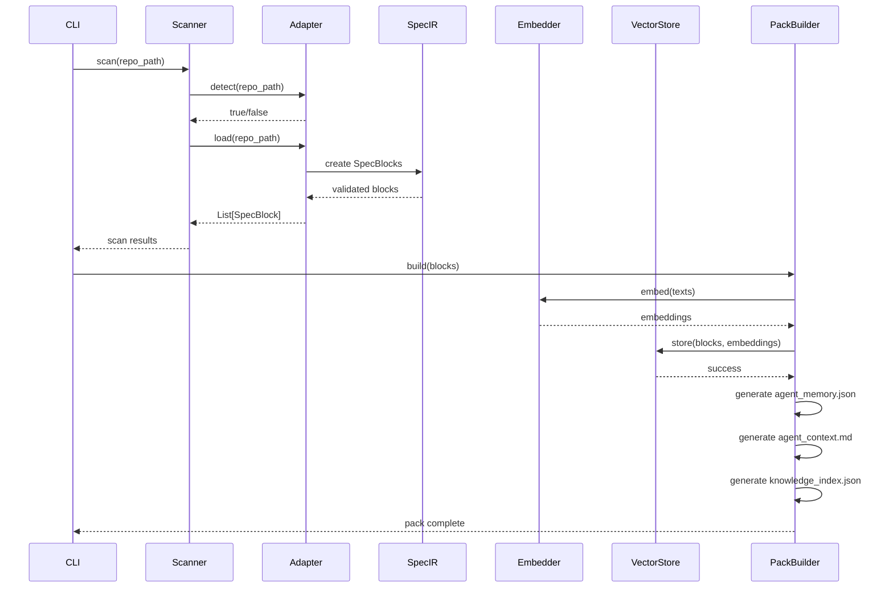

# Design Document

## Overview

SpecMem is a unified memory engine that transforms fragmented specification files into a searchable, agent-agnostic knowledge layer. The system follows a pipeline architecture: **Ingest → Normalize → Index → Output**.

```
┌─────────────────────────────────────────────────────────────────────────┐
│                           SpecMem Architecture                          │
├─────────────────────────────────────────────────────────────────────────┤
│                                                                         │
│  ┌──────────────┐    ┌──────────────┐    ┌──────────────┐              │
│  │   Adapters   │───▶│   SpecIR     │───▶│  VectorStore │              │
│  │  (Ingest)    │    │  (Normalize) │    │   (Index)    │              │
│  └──────────────┘    └──────────────┘    └──────────────┘              │
│        │                    │                   │                       │
│        ▼                    ▼                   ▼                       │
│  ┌──────────────┐    ┌──────────────┐    ┌──────────────┐              │
│  │ KiroAdapter  │    │  SpecBlock   │    │   LanceDB    │              │
│  │ TesslAdapter │    │  Pydantic    │    │   Chroma     │              │
│  │ SpecKit...   │    │   Models     │    │   Qdrant     │              │
│  └──────────────┘    └──────────────┘    └──────────────┘              │
│                                                 │                       │
│                                                 ▼                       │
│                           ┌─────────────────────────────────┐          │
│                           │      Agent Experience Pack       │          │
│                           │  .specmem/                       │          │
│                           │  ├── agent_memory.json           │          │
│                           │  ├── agent_context.md            │          │
│                           │  └── knowledge_index.json        │          │
│                           └─────────────────────────────────┘          │
└─────────────────────────────────────────────────────────────────────────┘
```

## Architecture

### Repository Structure

```
specmem/
├── cli/                    # Typer-based CLI commands
│   ├── __init__.py
│   ├── main.py            # CLI entry point
│   └── commands/          # Individual command modules
├── core/                   # Core domain models and logic
│   ├── __init__.py
│   ├── specir.py          # SpecBlock Pydantic models
│   ├── config.py          # Configuration management
│   └── memory_bank.py     # Chunking, ranking, scoring
├── adapters/              # Spec framework adapters
│   ├── __init__.py
│   ├── base.py            # SpecAdapter interface
│   ├── kiro.py            # Kiro adapter (MVP)
│   ├── tessl.py           # Tessl adapter
│   └── speckit.py         # SpecKit adapter
├── vectordb/              # Vector storage backends
│   ├── __init__.py
│   ├── base.py            # VectorStore interface
│   ├── lancedb.py         # LanceDB implementation
│   └── embeddings.py      # Embedding provider abstraction
├── agentx/                # Agent Experience Pack builder
│   ├── __init__.py
│   └── pack_builder.py    # Pack generation logic
├── impact/                # SpecImpact dependency analyzer
│   ├── __init__.py
│   └── analyzer.py        # Code-to-spec mapping
├── output/                # Output generators
│   ├── __init__.py
│   └── living_docs.py     # Living documentation generator
└── tests/                 # Test suite
    ├── unit/
    ├── property/
    └── integration/
```

### Design Principles

1. **Adapter Pattern**: Each SDD framework has a dedicated adapter conforming to `SpecAdapter` interface
2. **Repository Pattern**: Vector storage abstracted behind `VectorStore` interface for backend swapping
3. **Pydantic Models**: All data structures use Pydantic for validation and serialization
4. **CLI Delegation**: CLI commands contain no business logic, delegating to core modules
5. **Pluggable Embeddings**: Embedding generation abstracted for local/cloud provider switching

## Components and Interfaces

### 1. SpecAdapter Interface

```python
from abc import ABC, abstractmethod
from typing import List
from specmem.core.specir import SpecBlock

class SpecAdapter(ABC):
    """Base interface for all spec framework adapters."""

    @abstractmethod
    def detect(self, repo_path: str) -> bool:
        """Check if this adapter's framework is present in the repository."""
        pass

    @abstractmethod
    def load(self, repo_path: str) -> List[SpecBlock]:
        """Load and parse specs, returning normalized SpecBlocks."""
        pass

    @property
    @abstractmethod
    def name(self) -> str:
        """Human-readable adapter name."""
        pass
```

### 2. VectorStore Interface

```python
from abc import ABC, abstractmethod
from typing import List, Optional
from specmem.core.specir import SpecBlock

class VectorStore(ABC):
    """Abstract interface for vector database backends."""

    @abstractmethod
    def initialize(self) -> None:
        """Initialize the vector store and create schema if needed."""
        pass

    @abstractmethod
    def store(self, blocks: List[SpecBlock], embeddings: List[List[float]]) -> None:
        """Store SpecBlocks with their embeddings."""
        pass

    @abstractmethod
    def query(self, embedding: List[float], top_k: int = 10,
              include_legacy: bool = False) -> List[SpecBlock]:
        """Query for similar SpecBlocks by embedding vector."""
        pass

    @abstractmethod
    def get_pinned(self) -> List[SpecBlock]:
        """Retrieve all pinned (deterministic) SpecBlocks."""
        pass

    @abstractmethod
    def update_status(self, block_id: str, status: str) -> None:
        """Update the lifecycle status of a SpecBlock."""
        pass
```

### 2.1 LanceDB Backend (Default)

LanceDB is the default vector store due to its:
- **DiskANN-based search**: Fast approximate nearest neighbor search optimized for disk
- **Serverless architecture**: No separate server process required
- **Native Python integration**: Direct integration without network overhead
- **Columnar storage**: Efficient storage and retrieval of structured data

```python
import lancedb
from specmem.vectordb.base import VectorStore

class LanceDBStore(VectorStore):
    """LanceDB implementation using DiskANN for fast vector search."""

    def __init__(self, db_path: str = ".specmem/vectordb"):
        self.db_path = db_path
        self.db = None
        self.table = None

    def initialize(self) -> None:
        """Initialize LanceDB and create table schema."""
        self.db = lancedb.connect(self.db_path)
        # Schema includes: id, type, text, source, status, tags, links, pinned, vector

    def store(self, blocks: List[SpecBlock], embeddings: List[List[float]]) -> None:
        """Store blocks with embeddings using LanceDB's columnar format."""
        data = [
            {
                "id": block.id,
                "type": block.type.value,
                "text": block.text,
                "source": block.source,
                "status": block.status.value,
                "tags": block.tags,
                "links": block.links,
                "pinned": block.pinned,
                "vector": embedding
            }
            for block, embedding in zip(blocks, embeddings)
        ]
        self.table = self.db.create_table("specblocks", data, mode="overwrite")

    def query(self, embedding: List[float], top_k: int = 10,
              include_legacy: bool = False) -> List[SpecBlock]:
        """Query using DiskANN-based approximate nearest neighbor search."""
        results = self.table.search(embedding).limit(top_k)
        if not include_legacy:
            results = results.where("status != 'legacy' AND status != 'obsolete'")
        return [self._to_specblock(row) for row in results.to_list()]
```

### 2.2 AgentVectorDB Integration (Optional Advanced Backend)

AgentVectorDB from Superagentic AI provides specialized features for AI agent memory:
- **Agent-optimized schemas**: Pre-built schemas for agent memory patterns
- **Memory lifecycle management**: Built-in support for memory states
- **Context window optimization**: Automatic chunking and prioritization

```python
from specmem.vectordb.base import VectorStore

class AgentVectorDBStore(VectorStore):
    """AgentVectorDB implementation for advanced agent memory features.

    Reference: https://github.com/superagentic/agentvectordb
    """

    def __init__(self, config: dict):
        self.config = config
        self.client = None

    def initialize(self) -> None:
        """Initialize AgentVectorDB with optimized agent memory schema."""
        # Uses specialized schema for agent memory patterns
        # Includes: memory_type, importance_score, access_count, decay_factor
        pass

    def store(self, blocks: List[SpecBlock], embeddings: List[List[float]]) -> None:
        """Store with agent-specific metadata for memory management."""
        # Adds importance scoring and access tracking
        pass

    def query(self, embedding: List[float], top_k: int = 10,
              include_legacy: bool = False) -> List[SpecBlock]:
        """Query with agent-aware ranking and context optimization."""
        # Uses importance-weighted similarity scoring
        pass
```

### Vector Backend Selection

The vector backend is selected via configuration:

```toml
# .specmem.toml
[vectordb]
backend = "lancedb"  # Default: fast DiskANN-based search
# backend = "agentvectordb"  # Advanced: agent-optimized memory
# backend = "chroma"  # Alternative: ChromaDB
# backend = "qdrant"  # Alternative: Qdrant
path = ".specmem/vectordb"
```

### 3. EmbeddingProvider Interface

```python
from abc import ABC, abstractmethod
from typing import List

class EmbeddingProvider(ABC):
    """Abstract interface for embedding generation."""

    @abstractmethod
    def embed(self, texts: List[str]) -> List[List[float]]:
        """Generate embeddings for a list of texts."""
        pass

    @property
    @abstractmethod
    def dimension(self) -> int:
        """Return the embedding dimension size."""
        pass
```

## Data Models

### SpecBlock (Core Model)

```python
from pydantic import BaseModel, Field, field_validator
from typing import Literal, List, Optional
from enum import Enum
import hashlib

class SpecType(str, Enum):
    REQUIREMENT = "requirement"
    DESIGN = "design"
    TASK = "task"
    DECISION = "decision"
    KNOWLEDGE = "knowledge"
    MD = "md"

class SpecStatus(str, Enum):
    ACTIVE = "active"
    DEPRECATED = "deprecated"
    LEGACY = "legacy"
    OBSOLETE = "obsolete"

class SpecBlock(BaseModel):
    """Canonical representation of a specification unit."""

    id: str = Field(..., description="Unique deterministic ID")
    type: SpecType = Field(..., description="Classification of the spec block")
    text: str = Field(..., min_length=1, description="Content of the specification")
    source: str = Field(..., description="Source file path")
    status: SpecStatus = Field(default=SpecStatus.ACTIVE)
    tags: List[str] = Field(default_factory=list)
    links: List[str] = Field(default_factory=list, description="Related SpecBlock IDs")
    pinned: bool = Field(default=False, description="Deterministic memory flag")

    @field_validator('text')
    @classmethod
    def text_not_empty(cls, v: str) -> str:
        if not v.strip():
            raise ValueError('text cannot be empty or whitespace only')
        return v

    @classmethod
    def generate_id(cls, source: str, text: str) -> str:
        """Generate deterministic ID from source and content."""
        content = f"{source}:{text}"
        return hashlib.sha256(content.encode()).hexdigest()[:16]

    def to_json(self) -> str:
        """Serialize to JSON string."""
        return self.model_dump_json()

    @classmethod
    def from_json(cls, json_str: str) -> "SpecBlock":
        """Deserialize from JSON string."""
        return cls.model_validate_json(json_str)
```

### Configuration Model

```python
from pydantic import BaseModel, Field
from typing import Literal, Optional

class EmbeddingConfig(BaseModel):
    provider: Literal["local", "openai", "anthropic", "gemini", "together"] = "local"
    model: str = "all-MiniLM-L6-v2"
    api_key: Optional[str] = None

class VectorDBConfig(BaseModel):
    """Vector database configuration.

    Backends:
    - lancedb (default): Fast DiskANN-based search, serverless, columnar storage
    - agentvectordb: Agent-optimized memory from Superagentic AI
    - chroma: ChromaDB for simple use cases
    - qdrant: Qdrant for distributed deployments
    - sqlite-vec: SQLite-based for minimal dependencies
    """
    backend: Literal["lancedb", "agentvectordb", "chroma", "qdrant", "sqlite-vec"] = "lancedb"
    path: str = ".specmem/vectordb"
    # AgentVectorDB-specific options
    agentvectordb_api_key: Optional[str] = None
    agentvectordb_endpoint: Optional[str] = None

class SpecMemConfig(BaseModel):
    embedding: EmbeddingConfig = Field(default_factory=EmbeddingConfig)
    vectordb: VectorDBConfig = Field(default_factory=VectorDBConfig)
    adapters: List[str] = Field(default_factory=lambda: ["kiro"])
```

### Agent Experience Pack Models

```python
from pydantic import BaseModel, Field
from typing import List, Dict

class AgentMemory(BaseModel):
    """Structure for agent_memory.json output."""
    version: str = "1.0"
    blocks: List[SpecBlock]
    pinned_ids: List[str]
    statistics: Dict[str, int]

class KnowledgeIndex(BaseModel):
    """Structure for knowledge_index.json output."""
    keywords: Dict[str, List[str]]  # keyword -> list of block IDs
    type_index: Dict[str, List[str]]  # type -> list of block IDs
    source_index: Dict[str, List[str]]  # source file -> list of block IDs
```

## Correctness Properties

*A property is a characteristic or behavior that should hold true across all valid executions of a system-essentially, a formal statement about what the system should do. Properties serve as the bridge between human-readable specifications and machine-verifiable correctness guarantees.*

### Property 1: SpecBlock Serialization Round-Trip

*For any* valid SpecBlock, serializing to JSON and deserializing back SHALL produce an equivalent SpecBlock with identical field values.

**Validates: Requirements 2.6, 2.7**

### Property 2: SpecBlock ID Determinism

*For any* source path and text content, generating a SpecBlock ID multiple times SHALL always produce the same ID value.

**Validates: Requirements 2.2**

### Property 3: Empty Text Rejection

*For any* string composed entirely of whitespace characters, creating a SpecBlock with that text SHALL raise a validation error.

**Validates: Requirements 2.5**

### Property 4: Adapter Detection Consistency

*For any* repository path, if an adapter's `detect()` method returns true, calling `detect()` again on the same path SHALL return true.

**Validates: Requirements 1.6, 1.7**

### Property 5: Vector Query Relevance Ordering

*For any* query embedding and result set, the returned SpecBlocks SHALL be ordered by descending similarity score.

**Validates: Requirements 3.3, 6.3**

### Property 6: Pinned Block Inclusion

*For any* query against memory containing pinned SpecBlocks, all pinned blocks SHALL appear in the results regardless of similarity score.

**Validates: Requirements 4.1, 4.2**

### Property 7: Legacy Block Exclusion

*For any* standard query (without include_legacy flag) against memory containing legacy SpecBlocks, no legacy blocks SHALL appear in the results.

**Validates: Requirements 5.3, 5.5**

### Property 8: Status Transition Persistence

*For any* SpecBlock whose status is changed, querying that block after persistence SHALL return the updated status.

**Validates: Requirements 5.7**

### Property 9: Configuration Validation

*For any* valid configuration file content, loading and saving the configuration SHALL produce equivalent configuration values.

**Validates: Requirements 11.1, 11.5**

### Property 10: Agent Pack Completeness

*For any* set of active SpecBlocks, the generated Agent Experience Pack SHALL contain all active blocks in agent_memory.json.

**Validates: Requirements 7.2**

## Error Handling

### Error Categories

1. **Adapter Errors**: Malformed spec files, missing files, parse failures
   - Strategy: Log warning, skip invalid content, continue processing
   - User feedback: Summary of skipped items in scan output

2. **Vector Store Errors**: Connection failures, schema issues, query failures
   - Strategy: Raise descriptive exception, suggest remediation
   - Fallback: None (critical path)

3. **Embedding Errors**: Provider unavailable, rate limits, invalid input
   - Strategy: Fall back to local embeddings, log warning
   - User feedback: Notify of fallback in verbose mode

4. **Configuration Errors**: Invalid values, missing required fields
   - Strategy: Use defaults for invalid fields, report validation errors
   - User feedback: List of invalid fields and applied defaults

5. **CLI Errors**: Invalid arguments, missing dependencies
   - Strategy: Display descriptive error, exit with non-zero code
   - User feedback: Actionable error message with suggestions

### Error Response Format

```python
class SpecMemError(Exception):
    """Base exception for SpecMem errors."""
    def __init__(self, message: str, code: str, details: Optional[dict] = None):
        self.message = message
        self.code = code
        self.details = details or {}
        super().__init__(self.message)

class AdapterError(SpecMemError):
    """Raised when an adapter encounters an error."""
    pass

class VectorStoreError(SpecMemError):
    """Raised when vector storage operations fail."""
    pass

class ConfigurationError(SpecMemError):
    """Raised when configuration is invalid."""
    pass
```

## Testing Strategy

### Dual Testing Approach

SpecMem uses both unit tests and property-based tests for comprehensive coverage:

- **Unit tests**: Verify specific examples, edge cases, and integration points
- **Property-based tests**: Verify universal properties across all valid inputs

### Property-Based Testing Framework

- **Library**: Hypothesis (Python)
- **Minimum iterations**: 100 per property
- **Annotation format**: `# Feature: specmem-mvp, Property {N}: {description}`

### Test Organization

```
tests/
├── unit/
│   ├── test_specir.py          # SpecBlock model tests
│   ├── test_adapters.py        # Adapter unit tests
│   ├── test_vectordb.py        # VectorStore tests
│   └── test_cli.py             # CLI command tests
├── property/
│   ├── test_specblock_props.py # SpecBlock properties
│   ├── test_adapter_props.py   # Adapter properties
│   └── test_memory_props.py    # Memory system properties
└── integration/
    ├── test_pipeline.py        # End-to-end pipeline tests
    └── test_pack_generation.py # Agent pack tests
```

### Key Test Scenarios

1. **SpecBlock Validation**
   - Valid block creation
   - Empty text rejection
   - ID generation determinism
   - JSON round-trip

2. **Kiro Adapter**
   - Detection with valid .kiro directory
   - Detection with missing files
   - Parsing requirements.md structure
   - Parsing design.md structure
   - Parsing tasks.md structure
   - Handling malformed content

3. **Vector Storage**
   - Store and retrieve blocks
   - Query by similarity
   - Pinned block retrieval
   - Status updates
   - Legacy filtering

4. **Agent Pack Generation**
   - Complete pack structure
   - All active blocks included
   - Knowledge index accuracy
   - Idempotent regeneration

## Component Interaction Diagram


