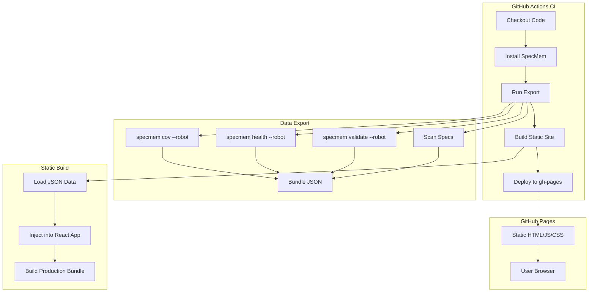

# Design Document

## Overview

The Static Dashboard Deploy feature enables users to generate and deploy a read-only SpecMem dashboard to GitHub Pages. The system consists of three main components:

1. **Data Exporter** - CLI command that generates JSON data bundles from spec analysis
2. **Static Site Builder** - Builds a React SPA with embedded data (no API calls)
3. **GitHub Action** - Automates export, build, and deployment to GitHub Pages

This is a **static-only solution** - all data is pre-computed and embedded at build time. There is no backend server, no live search, and no real-time updates.

## Architecture



## Components and Interfaces

### 1. Data Exporter (`specmem/export/`)

```python
# specmem/export/exporter.py
from dataclasses import dataclass
from datetime import datetime
from pathlib import Path

@dataclass
class ExportMetadata:
    """Metadata about the export."""
    generated_at: datetime
    commit_sha: str | None
    branch: str | None
    specmem_version: str

@dataclass  
class ExportBundle:
    """Complete data bundle for static dashboard."""
    metadata: ExportMetadata
    coverage: dict  # From specmem cov --robot
    health: dict    # From specmem health --robot
    validation: dict  # From specmem validate --robot
    specs: list[dict]  # Parsed spec content
    guidelines: list[dict]  # Parsed guidelines
    history: list[dict] | None  # Historical data points

class StaticExporter:
    """Exports spec data for static dashboard."""
    
    def __init__(self, workspace: Path, output_dir: Path):
        self.workspace = workspace
        self.output_dir = output_dir
    
    def export(self) -> ExportBundle:
        """Generate complete data export."""
        ...
    
    def save(self, bundle: ExportBundle) -> Path:
        """Save bundle to JSON file."""
        ...
    
    def append_history(self, bundle: ExportBundle, history_file: Path) -> None:
        """Append current metrics to history file."""
        ...
```

### 2. Static Site Builder (`specmem/export/builder.py`)

```python
class StaticSiteBuilder:
    """Builds static dashboard site."""
    
    def __init__(self, data_path: Path, output_dir: Path):
        self.data_path = data_path
        self.output_dir = output_dir
    
    def build(self) -> Path:
        """Build static site with embedded data.
        
        Returns:
            Path to built site directory
        """
        ...
    
    def inject_data(self, data: dict) -> str:
        """Inject data into HTML template.
        
        Returns:
            HTML with embedded JSON data
        """
        ...
```

### 3. CLI Commands

```python
# specmem/cli/export.py
@app.command()
def export(
    output: Path = Option(".specmem/export", help="Output directory"),
    include_history: bool = Option(True, help="Append to history file"),
) -> None:
    """Export spec data for static dashboard."""
    ...

@app.command()
def build_static(
    data_dir: Path = Option(".specmem/export", help="Data directory"),
    output: Path = Option(".specmem/static", help="Output directory"),
) -> None:
    """Build static dashboard site."""
    ...
```

### 4. GitHub Action (`action.yml`)

```yaml
name: 'SpecMem Dashboard Deploy'
description: 'Deploy static SpecMem dashboard to GitHub Pages'

inputs:
  deploy_path:
    description: 'Path within GitHub Pages (default: specmem-dashboard)'
    default: 'specmem-dashboard'
  force:
    description: 'Force deployment even if conflicts detected'
    default: 'false'
  include_history:
    description: 'Include historical trend data'
    default: 'true'
  github_token:
    description: 'GitHub token for deployment'
    required: true

outputs:
  dashboard_url:
    description: 'URL of deployed dashboard'
```

## Data Models

### Export Data Schema

```typescript
interface ExportData {
  metadata: {
    generated_at: string;  // ISO timestamp
    commit_sha: string | null;
    branch: string | null;
    specmem_version: string;
  };
  
  coverage: {
    coverage_percentage: number;
    features: Array<{
      feature_name: string;
      coverage_percentage: number;
      tested_count: number;
      total_count: number;
    }>;
  };
  
  health: {
    overall_score: number;
    letter_grade: string;
    breakdown: Array<{
      category: string;
      score: number;
      weight: number;
    }>;
  };
  
  validation: {
    errors: string[];
    warnings: string[];
  };
  
  specs: Array<{
    name: string;
    path: string;
    requirements: string;  // Markdown content
    design: string | null;
    tasks: string | null;
    task_progress: {
      total: number;
      completed: number;
    };
  }>;
  
  guidelines: Array<{
    name: string;
    path: string;
    content: string;
    source_format: string;
  }>;
  
  history: Array<{
    timestamp: string;
    coverage_percentage: number;
    health_score: number;
    validation_errors: number;
  }> | null;
}
```

### Static Dashboard React Components

```
specmem/ui/static/
├── src/
│   ├── App.tsx           # Main app with routing
│   ├── data.ts           # Data loading (from embedded JSON)
│   ├── components/
│   │   ├── Header.tsx    # Shows metadata, freshness warning
│   │   ├── Overview.tsx  # Summary cards
│   │   ├── Coverage.tsx  # Coverage charts
│   │   ├── Health.tsx    # Health breakdown
│   │   ├── Specs.tsx     # Spec browser with client-side search
│   │   ├── SpecDetail.tsx
│   │   ├── Guidelines.tsx
│   │   └── Trends.tsx    # Historical charts
│   └── index.html        # Template with data injection point
├── package.json
└── vite.config.ts
```


## Correctness Properties

*A property is a characteristic or behavior that should hold true across all valid executions of a system-essentially, a formal statement about what the system should do. Properties serve as the bridge between human-readable specifications and machine-verifiable correctness guarantees.*

### Property 1: Export data completeness

*For any* valid workspace with specs, the exported JSON bundle SHALL contain all required top-level keys: `metadata`, `coverage`, `health`, `validation`, `specs`, and `guidelines`.

**Validates: Requirements 1.1, 5.1, 5.2, 5.3, 5.4, 5.5, 5.6**

### Property 2: Export round-trip consistency

*For any* exported data bundle, serializing to JSON and deserializing back SHALL produce an equivalent data structure.

**Validates: Requirements 1.1**

### Property 3: Conflict detection accuracy

*For any* deployment target directory containing files matching documentation patterns (index.html, _config.yml, mkdocs.yml, docusaurus.config.js), the conflict detector SHALL return a warning.

**Validates: Requirements 3.1**

### Property 4: Deploy path configuration

*For any* valid path string provided as `deploy_path`, the generated site SHALL be configured to serve from that path.

**Validates: Requirements 3.3**

### Property 5: Overwrite protection

*For any* deployment where target directory contains existing files AND `force` is false, the deployment SHALL fail with an error.

**Validates: Requirements 3.4**

### Property 6: Client-side search filtering

*For any* list of specs and any search query string, the filtered results SHALL only contain specs where the name or content contains the query (case-insensitive).

**Validates: Requirements 6.1, 6.2**

### Property 7: Multi-criteria filtering

*For any* list of specs and any combination of filter criteria (feature, status, health grade), the filtered results SHALL only contain specs matching ALL specified criteria.

**Validates: Requirements 6.3**

### Property 8: History append consistency

*For any* existing history file with N entries, running export with `include_history=true` SHALL result in a history file with N+1 entries.

**Validates: Requirements 7.1**

### Property 9: History truncation

*For any* history file with more than the configured limit (default 30), the exported history SHALL contain exactly the limit number of most recent entries.

**Validates: Requirements 7.3**

## Error Handling

| Error Condition | Handling Strategy |
|-----------------|-------------------|
| No specs found in workspace | Return empty data with warning, still generate dashboard |
| Invalid spec format | Skip invalid spec, log warning, continue with valid specs |
| GitHub Pages conflict detected | Emit warning, fail if `force=false` and would overwrite |
| Build failure | Exit with error code, provide detailed error message |
| History file corrupted | Log warning, start fresh history |
| Insufficient permissions | Exit with clear permission error message |
| Network failure during deploy | Retry up to 3 times, then fail with error |

## Testing Strategy

### Property-Based Testing

We will use `hypothesis` for property-based testing to verify the correctness properties defined above.

**Test Configuration:**
- Minimum 100 iterations per property test
- Each test tagged with property reference: `**Feature: static-dashboard-deploy, Property {N}: {description}**`

### Unit Tests

Unit tests will cover:
- Export data structure validation
- Conflict detection patterns
- Path configuration logic
- History file operations

### Integration Tests

Integration tests will verify:
- End-to-end export → build → output flow
- GitHub Action workflow execution (mocked)
- Static site serves correctly

### Test Files

```
tests/property/test_static_export_props.py  # Property tests for export
tests/property/test_static_filter_props.py  # Property tests for filtering
tests/unit/test_static_exporter.py          # Unit tests for exporter
tests/unit/test_conflict_detector.py        # Unit tests for conflict detection
```
