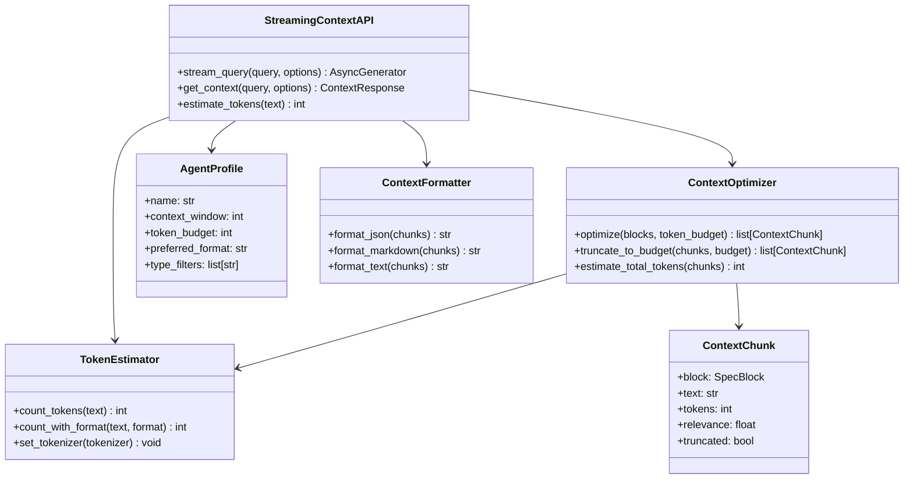

# Streaming Context API Design Document

## Overview

This design adds a Streaming Context API for real-time agent queries and context window optimization. The API enables AI agents to query SpecMem dynamically, receiving relevant specifications streamed in real-time with automatic sizing to fit within token limits. This allows agents to access project knowledge during conversations without exceeding their context windows.

## Architecture



## Components and Interfaces

### StreamingContextAPI

The main API class for streaming context to agents:

```python
class StreamingContextAPI:
    """API for streaming context to AI agents."""

    def __init__(
        self,
        memory_bank: MemoryBank,
        token_estimator: TokenEstimator,
        default_budget: int = 4000,
    ) -> None:
        """Initialize the streaming API."""

    async def stream_query(
        self,
        query: str,
        token_budget: int | None = None,
        format: str = "json",
        type_filters: list[str] | None = None,
        profile: str | None = None,
    ) -> AsyncGenerator[ContextChunk, None]:
        """Stream relevant context chunks for a query."""

    def get_context(
        self,
        query: str,
        token_budget: int | None = None,
        format: str = "json",
        type_filters: list[str] | None = None,
    ) -> ContextResponse:
        """Get context synchronously (non-streaming)."""
```

### ContextOptimizer

Handles token budget optimization and content truncation:

```python
class ContextOptimizer:
    """Optimizes context to fit within token budgets."""

    def __init__(self, token_estimator: TokenEstimator) -> None:
        """Initialize with token estimator."""

    def optimize(
        self,
        blocks: list[SpecBlock],
        scores: list[float],
        token_budget: int,
        format: str = "json",
    ) -> list[ContextChunk]:
        """Optimize blocks to fit within token budget.

        Prioritizes:
        1. Pinned blocks (always included if budget allows)
        2. Higher relevance scores
        3. Complete content over truncated
        """

    def truncate_to_budget(
        self,
        chunks: list[ContextChunk],
        budget: int,
    ) -> list[ContextChunk]:
        """Truncate chunks to fit budget, preserving sentence boundaries."""
```

### TokenEstimator

Estimates token counts for various content:

```python
class TokenEstimator:
    """Estimates token counts for text content."""

    DEFAULT_CHARS_PER_TOKEN = 4  # Conservative estimate

    def __init__(self, tokenizer: str = "cl100k_base") -> None:
        """Initialize with tokenizer name."""

    def count_tokens(self, text: str) -> int:
        """Count tokens in text."""

    def count_with_format(self, text: str, format: str) -> int:
        """Count tokens including format overhead."""

    def estimate_overhead(self, format: str, num_blocks: int) -> int:
        """Estimate formatting overhead tokens."""
```

### AgentProfile

Configuration for agent-specific settings:

```python
@dataclass
class AgentProfile:
    """Profile defining agent context preferences."""

    name: str
    context_window: int = 8000  # Total context window
    token_budget: int = 4000    # Budget for spec memory
    preferred_format: str = "json"
    type_filters: list[str] = field(default_factory=list)

    @classmethod
    def load(cls, name: str) -> "AgentProfile":
        """Load profile from configuration."""

    def save(self) -> None:
        """Save profile to configuration."""
```

### ContextFormatter

Formats context chunks for different output types:

```python
class ContextFormatter:
    """Formats context chunks for agent consumption."""

    def format(self, chunks: list[ContextChunk], format: str) -> str:
        """Format chunks in specified format."""

    def format_json(self, chunks: list[ContextChunk]) -> str:
        """Format as JSON with metadata."""

    def format_markdown(self, chunks: list[ContextChunk]) -> str:
        """Format as structured Markdown."""

    def format_text(self, chunks: list[ContextChunk]) -> str:
        """Format as plain text with separators."""
```

## Data Models

### ContextChunk

```python
@dataclass
class ContextChunk:
    """A chunk of context optimized for agent consumption."""

    block_id: str
    block_type: str
    source: str
    text: str
    tokens: int
    relevance: float
    pinned: bool
    truncated: bool = False
    original_tokens: int | None = None
```

### ContextResponse

```python
@dataclass
class ContextResponse:
    """Response from context query."""

    chunks: list[ContextChunk]
    total_tokens: int
    token_budget: int
    truncated_count: int
    query: str
    format: str
```

### StreamCompletion

```python
@dataclass
class StreamCompletion:
    """Completion signal for streaming."""

    total_chunks: int
    total_tokens: int
    token_budget: int
    truncated_count: int
    elapsed_ms: float
```

## API Endpoints

### REST Endpoints

```
POST /api/context/query
  Body: { query, token_budget?, format?, type_filters?, profile? }
  Response: ContextResponse

GET /api/context/stream
  Query: query, token_budget?, format?, type_filters?, profile?
  Response: Server-Sent Events stream

GET /api/profiles
  Response: list of AgentProfile

POST /api/profiles
  Body: AgentProfile
  Response: created profile

GET /api/profiles/{name}
  Response: AgentProfile
```

### WebSocket Protocol

```
Client -> Server: { type: "query", query: "...", options: {...} }
Server -> Client: { type: "chunk", data: ContextChunk }
Server -> Client: { type: "chunk", data: ContextChunk }
...
Server -> Client: { type: "complete", data: StreamCompletion }
```

## Correctness Properties

*A property is a characteristic or behavior that should hold true across all valid executions of a system-essentially, a formal statement about what the system should do. Properties serve as the bridge between human-readable specifications and machine-verifiable correctness guarantees.*

### Property 1: Result Ordering

*For any* query result set, pinned blocks SHALL appear before non-pinned blocks, and within each group, blocks SHALL be ordered by relevance score descending.

**Validates: Requirements 1.2, 1.3**

### Property 2: Token Budget Compliance

*For any* query with a specified token budget, the total tokens in the response SHALL NOT exceed that budget.

**Validates: Requirements 2.1**

### Property 3: Truncation Priority

*For any* response that requires truncation, higher-relevance content SHALL be preserved over lower-relevance content.

**Validates: Requirements 2.2**

### Property 4: Sentence Boundary Preservation

*For any* truncated text, the truncation point SHALL occur at a sentence boundary (period, question mark, or exclamation followed by space or end).

**Validates: Requirements 2.3**

### Property 5: Profile Round-Trip

*For any* valid agent profile, saving and then loading the profile SHALL return an equivalent configuration.

**Validates: Requirements 3.2**

### Property 6: Format Completeness - JSON

*For any* JSON-formatted response, each chunk SHALL include id, type, source, and relevance score fields.

**Validates: Requirements 4.3**

### Property 7: Format Completeness - Markdown

*For any* Markdown-formatted response, the output SHALL contain headers (lines starting with #) and structured content.

**Validates: Requirements 4.2**

### Property 8: Type Filter Correctness

*For any* query with type filters, all returned blocks SHALL match at least one of the specified types.

**Validates: Requirements 5.1, 5.2**

### Property 9: Token Estimation Accuracy

*For any* text, the estimated token count SHALL be within 5% of the actual token count when using the same tokenizer.

**Validates: Requirements 7.3**

### Property 10: Concurrent Request Handling

*For any* set of concurrent queries, all queries SHALL complete without deadlock and return valid results.

**Validates: Requirements 6.1**

## Error Handling

### Timeout Handling

```python
async def stream_with_timeout(
    self,
    query: str,
    timeout_ms: int = 5000,
) -> AsyncGenerator[ContextChunk | TimeoutIndicator, None]:
    """Stream with timeout, returning partial results if exceeded."""
```

### Invalid Profile Fallback

```python
def get_profile(self, name: str) -> AgentProfile:
    """Get profile, falling back to default if not found."""
    profile = self._profiles.get(name)
    if profile is None:
        logger.warning(f"Unknown profile '{name}', using default")
        return AgentProfile(name="default")
    return profile
```

### Connection Cleanup

```python
async def cleanup_connection(self, connection_id: str) -> None:
    """Clean up resources when connection drops."""
    # Cancel pending operations
    # Release locks
    # Log disconnection
```

## Testing Strategy

### Property-Based Testing

Use **Hypothesis** for property-based testing:

```python
from hypothesis import given, strategies as st

# Token budget strategy
token_budget_strategy = st.integers(min_value=100, max_value=32000)

# Query strategy
query_strategy = st.text(min_size=1, max_size=500)

# Format strategy
format_strategy = st.sampled_from(["json", "markdown", "text"])

# Type filter strategy
type_filter_strategy = st.lists(
    st.sampled_from(["requirement", "design", "task", "decision", "knowledge"]),
    max_size=3,
)
```

### Unit Testing

- Test TokenEstimator accuracy against tiktoken
- Test ContextOptimizer truncation logic
- Test ContextFormatter output validity
- Test AgentProfile serialization

### Integration Testing

- Test streaming endpoint with mock memory bank
- Test concurrent request handling
- Test WebSocket protocol compliance
- Test timeout behavior

### Performance Testing

- Benchmark token estimation speed
- Measure streaming latency
- Test under concurrent load
