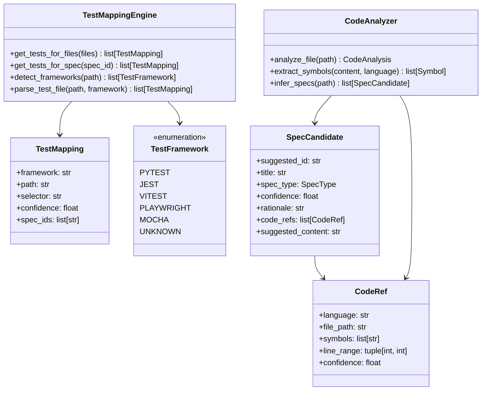

# Test Mapping Engine Design Document

## Overview

The Test Mapping Engine provides bidirectional mapping between specifications and tests. It enables SpecMem to:
1. Output which tests to run for code changes (framework-agnostic)
2. Enhance SpecIR with test_mappings, code_refs, and confidence scores
3. Infer specs from code via `specmem infer` command

## Architecture



## Components and Interfaces

### TestMapping

Framework-agnostic test reference:

```python
@dataclass
class TestMapping:
    """Framework-agnostic test reference."""

    framework: str      # pytest, jest, vitest, playwright, mocha
    path: str          # test file path
    selector: str      # test selector (e.g., test_auth::test_login)
    confidence: float  # 0.0 to 1.0
    spec_ids: list[str] = field(default_factory=list)  # linked spec IDs

    def to_dict(self) -> dict:
        """Serialize to dictionary."""

    @classmethod
    def from_dict(cls, data: dict) -> "TestMapping":
        """Deserialize from dictionary."""
```

### CodeRef

Code reference linking spec to implementation:

```python
@dataclass
class CodeRef:
    """Reference linking spec to implementation code."""

    language: str                    # python, javascript, typescript
    file_path: str                   # source file path
    symbols: list[str]               # function/class names
    line_range: tuple[int, int] | None = None  # (start, end) lines
    confidence: float = 1.0          # 0.0 to 1.0

    def to_dict(self) -> dict:
        """Serialize to dictionary."""

    @classmethod
    def from_dict(cls, data: dict) -> "CodeRef":
        """Deserialize from dictionary."""
```

### Enhanced SpecBlock

Extended SpecBlock with test mappings and code refs:

```python
@dataclass
class SpecBlock:
    """Enhanced SpecBlock with test and code mappings."""

    # Existing fields
    id: str
    type: SpecType
    text: str
    source: str
    status: SpecStatus
    tags: list[str]
    links: list[str]
    pinned: bool

    # New fields
    test_mappings: list[TestMapping] = field(default_factory=list)
    code_refs: list[CodeRef] = field(default_factory=list)
    confidence: float = 1.0  # Overall confidence for this spec
```

### TestMappingEngine

Main engine for test mapping:

```python
class TestMappingEngine:
    """Engine for mapping specs to tests and vice versa."""

    FRAMEWORK_PATTERNS = {
        "pytest": ["test_*.py", "*_test.py", "tests/**/*.py"],
        "jest": ["*.test.js", "*.test.ts", "*.spec.js", "*.spec.ts"],
        "vitest": ["*.test.ts", "*.spec.ts"],
        "playwright": ["*.spec.ts", "e2e/**/*.ts"],
        "mocha": ["test/**/*.js", "*.test.js"],
    }

    def __init__(self, workspace_path: Path) -> None:
        """Initialize with workspace path."""

    def get_tests_for_files(
        self,
        changed_files: list[str],
        max_results: int = 50,
    ) -> list[TestMapping]:
        """Get tests related to changed files."""

    def get_tests_for_spec(
        self,
        spec_id: str,
    ) -> list[TestMapping]:
        """Get tests mapped to a specific spec."""

    def detect_frameworks(self) -> list[str]:
        """Detect test frameworks in workspace."""

    def parse_test_file(
        self,
        path: Path,
        framework: str,
    ) -> list[TestMapping]:
        """Parse test file and extract test mappings."""
```

### CodeAnalyzer

Code analysis for spec inference:

```python
class CodeAnalyzer:
    """Analyzes code to infer specifications."""

    def __init__(self, workspace_path: Path) -> None:
        """Initialize with workspace path."""

    def analyze_file(self, path: Path) -> CodeAnalysis:
        """Analyze a code file."""

    def extract_symbols(
        self,
        content: str,
        language: str,
    ) -> list[Symbol]:
        """Extract function/class definitions."""

    def infer_specs(
        self,
        path: Path,
        existing_specs: list[SpecBlock] | None = None,
    ) -> list[SpecCandidate]:
        """Infer potential specs from code file."""
```

### SpecCandidate

Candidate spec inferred from code:

```python
@dataclass
class SpecCandidate:
    """Candidate spec inferred from code."""

    suggested_id: str
    title: str
    spec_type: SpecType
    confidence: float
    rationale: str
    code_refs: list[CodeRef] = field(default_factory=list)
    suggested_content: str = ""
    matched_spec_id: str | None = None  # If matches existing spec

    def to_dict(self) -> dict:
        """Serialize to dictionary."""
```

## Data Models

### Symbol

Extracted code symbol:

```python
@dataclass
class Symbol:
    """Extracted code symbol (function, class, etc.)."""

    name: str
    kind: str  # function, class, method
    docstring: str | None
    line_start: int
    line_end: int
    signature: str | None = None
```

### CodeAnalysis

Result of code analysis:

```python
@dataclass
class CodeAnalysis:
    """Result of analyzing a code file."""

    file_path: str
    language: str
    symbols: list[Symbol]
    imports: list[str]
    dependencies: list[str]
```

## Correctness Properties

*A property is a characteristic or behavior that should hold true across all valid executions of a system-essentially, a formal statement about what the system should do. Properties serve as the bridge between human-readable specifications and machine-verifiable correctness guarantees.*

### Property 1: TestMapping Completeness

*For any* TestMapping object, it SHALL contain non-empty framework, path, and selector fields.

**Validates: Requirements 1.2**

### Property 2: Confidence Ordering

*For any* list of test mappings with varying confidence scores, the results SHALL be ordered by confidence descending.

**Validates: Requirements 1.5**

### Property 3: SpecBlock Test Mapping Round-Trip

*For any* SpecBlock with test_mappings, serializing then deserializing SHALL produce an equivalent SpecBlock with identical test_mappings.

**Validates: Requirements 2.3, 2.4**

### Property 4: SpecBlock CodeRef Round-Trip

*For any* SpecBlock with code_refs, serializing then deserializing SHALL produce an equivalent SpecBlock with identical code_refs.

**Validates: Requirements 3.4, 3.5**

### Property 5: Confidence Range Validation

*For any* confidence value, the system SHALL reject values outside the range [0.0, 1.0].

**Validates: Requirements 4.2**

### Property 6: Code Symbol Extraction

*For any* code file with function/class definitions, the analyzer SHALL extract all top-level symbols with their names and docstrings.

**Validates: Requirements 5.2**

### Property 7: SpecCandidate Structure

*For any* inferred spec, the SpecCandidate SHALL contain suggested_id, title, spec_type, confidence, and rationale.

**Validates: Requirements 5.3**

### Property 8: Framework Detection

*For any* workspace with test files matching known patterns, the engine SHALL detect the correct framework(s).

**Validates: Requirements 6.1**

### Property 9: Test Selector Extraction

*For any* test file, parsing SHALL extract test names as valid selectors for the detected framework.

**Validates: Requirements 6.2, 6.4**

### Property 10: API Test Mapping Inclusion

*For any* ContextBundle returned by get_context_for_change, the suggested_tests field SHALL be a list (possibly empty).

**Validates: Requirements 7.1**

## Error Handling

```python
class TestMappingError(SpecMemError):
    """Error in test mapping operations."""
    pass

class CodeAnalysisError(SpecMemError):
    """Error in code analysis operations."""
    pass

class FrameworkDetectionError(TestMappingError):
    """Error detecting test framework."""
    pass
```

## Testing Strategy

### Property-Based Testing

Use **Hypothesis** for property-based testing:

```python
from hypothesis import given, strategies as st

# TestMapping strategy
test_mapping_strategy = st.builds(
    TestMapping,
    framework=st.sampled_from(["pytest", "jest", "vitest", "playwright", "mocha"]),
    path=st.text(min_size=1, max_size=100).filter(lambda x: "/" in x or "." in x),
    selector=st.text(min_size=1, max_size=100),
    confidence=st.floats(min_value=0.0, max_value=1.0),
)

# CodeRef strategy
code_ref_strategy = st.builds(
    CodeRef,
    language=st.sampled_from(["python", "javascript", "typescript"]),
    file_path=st.text(min_size=1, max_size=100),
    symbols=st.lists(st.text(min_size=1, max_size=50), max_size=5),
    confidence=st.floats(min_value=0.0, max_value=1.0),
)
```

### Unit Testing

- Test framework detection with sample project structures
- Test test file parsing for each framework
- Test code analysis with sample files
- Test spec inference with known code patterns

### Integration Testing

- Test end-to-end flow from code change to test suggestions
- Test CLI commands with real workspace
- Test API integration with SpecMemClient
