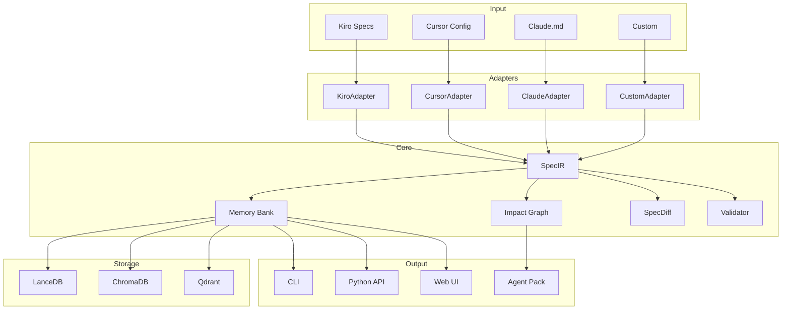

# 🔧 Advanced

Advanced topics for power users and contributors.

## Topics

<div class="feature-grid">
  <div class="feature-card">
    <h3><span class="emoji">✍️</span> Writing Adapters</h3>
    <p>Create custom adapters for new frameworks.</p>
    <a href="writing-adapters/" class="md-button">Learn →</a>
  </div>
  <div class="feature-card">
    <h3><span class="emoji">🗄️</span> Vector Backends</h3>
    <p>Configure and optimize vector databases.</p>
    <a href="vector-backends/" class="md-button">Configure →</a>
  </div>
  <div class="feature-card">
    <h3><span class="emoji">☁️</span> Cloud Embeddings</h3>
    <p>Use cloud embedding providers.</p>
    <a href="cloud-embeddings/" class="md-button">Setup →</a>
  </div>
  <div class="feature-card">
    <h3><span class="emoji">🔗</span> Agent Integration</h3>
    <p>Integrate SpecMem with AI agents.</p>
    <a href="agent-integration/" class="md-button">Integrate →</a>
  </div>
</div>

## Architecture Deep Dive



## Performance Tuning

### Embedding Batch Size

```toml
[embedding]
batch_size = 64  # Increase for faster indexing
```

### Vector Index Settings

```toml
[vectordb]
# LanceDB specific
index_type = "IVF_PQ"
num_partitions = 256
num_sub_vectors = 96
```

### Memory Usage

```toml
[memory]
# Limit in-memory cache
max_cache_size = 1000
# Enable disk-based storage
use_mmap = true
```

## Extending SpecMem

### Custom Validation Rules

```python
from specmem.validator import ValidationRule, register_rule

@register_rule
class MyRule(ValidationRule):
    name = "my_rule"

    def validate(self, spec):
        # Custom validation logic
        pass
```

### Custom Embedding Providers

```python
from specmem.vectordb.embeddings import EmbeddingProvider, register_provider

@register_provider("custom")
class CustomEmbeddings(EmbeddingProvider):
    def embed(self, text: str) -> list[float]:
        # Custom embedding logic
        pass
```

### Hooks and Events

```python
from specmem import on_scan, on_build

@on_scan
def my_scan_hook(result):
    print(f"Scanned {result.count} specs")

@on_build
def my_build_hook(result):
    print(f"Built pack at {result.path}")
```
