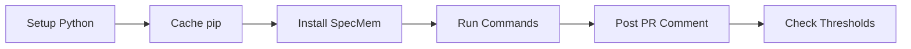

# GitHub Action

Run SpecMem analysis in your CI/CD pipeline with the official GitHub Action.

## Overview

The SpecMem GitHub Action analyzes your specifications and provides:

- 📊 **Spec Coverage** - Track acceptance criteria test coverage
- 💚 **Health Score** - Get a letter grade (A-F) for spec quality
- ✅ **Validation** - Check specs for structural issues
- 💬 **PR Comments** - Automatic results posted to PRs
- 🚦 **Threshold Checks** - Fail builds on quality drops

## Quick Start

Add to your workflow:

```yaml
name: Spec Analysis
on: [pull_request]

jobs:
  specmem:
    runs-on: ubuntu-latest
    steps:
      - uses: actions/checkout@v4
      - uses: specmem/specmem/.github/actions/specmem@main
```

## Installation Options

### From PyPI (Recommended)

```yaml
- uses: specmem/specmem/.github/actions/specmem@main
  with:
    install_from: pypi
    version: latest
```

### From GitHub (Latest Development)

```yaml
- uses: specmem/specmem/.github/actions/specmem@main
  with:
    install_from: github
    github_repo: specmem/specmem
    version: main
```

### Pinned Version

```yaml
- uses: specmem/specmem/.github/actions/specmem@main
  with:
    version: "0.1.0"
```

## Inputs

| Input | Description | Default |
|-------|-------------|---------|
| `commands` | Commands to run (comma-separated: `cov,health,validate`) | `cov,health` |
| `install_from` | Installation source: `pypi` or `github` | `pypi` |
| `version` | Version (PyPI) or git ref (GitHub) | `latest` |
| `github_repo` | GitHub repo for installation | `specmem/specmem` |
| `working_directory` | Directory to run analysis in | `.` |
| `comment_on_pr` | Post results as PR comment | `true` |
| `coverage_threshold` | Minimum coverage percentage (0-100) | `0` |
| `health_threshold` | Minimum health grade (A/B/C/D) | `` |
| `fail_on_validation_errors` | Fail if validation finds errors | `false` |
| `github_token` | Token for PR comments | `${{ github.token }}` |
| `python_version` | Python version to use | `3.11` |

## Outputs

| Output | Description |
|--------|-------------|
| `coverage_percentage` | Spec coverage percentage (0-100) |
| `health_grade` | Health grade (A-F) |
| `health_score` | Health score (0-100) |
| `validation_errors` | Number of validation errors |
| `results_json` | Full results as JSON |

## Examples

### Basic Analysis

```yaml
- uses: specmem/specmem/.github/actions/specmem@main
```

### With Quality Thresholds

Fail the build if quality drops:

```yaml
- uses: specmem/specmem/.github/actions/specmem@main
  with:
    coverage_threshold: 80
    health_threshold: B
    fail_on_validation_errors: true
```

### All Commands

Run coverage, health, and validation:

```yaml
- uses: specmem/specmem/.github/actions/specmem@main
  with:
    commands: cov,health,validate
```

### Monorepo Support

Analyze specs in a subdirectory:

```yaml
- uses: specmem/specmem/.github/actions/specmem@main
  with:
    working_directory: packages/my-app
```

### Use Outputs in Subsequent Steps

```yaml
- uses: specmem/specmem/.github/actions/specmem@main
  id: specmem

- name: Check Results
  run: |
    echo "Coverage: ${{ steps.specmem.outputs.coverage_percentage }}%"
    echo "Health: ${{ steps.specmem.outputs.health_grade }}"
    
- name: Custom Logic
  if: steps.specmem.outputs.health_grade == 'F'
  run: echo "::warning::Health grade is failing!"
```

### Without PR Comments

```yaml
- uses: specmem/specmem/.github/actions/specmem@main
  with:
    comment_on_pr: false
```

### Matrix Testing

Test across multiple Python versions:

```yaml
jobs:
  specmem:
    runs-on: ubuntu-latest
    strategy:
      matrix:
        python: ['3.11', '3.12']
    steps:
      - uses: actions/checkout@v4
      - uses: specmem/specmem/.github/actions/specmem@main
        with:
          python_version: ${{ matrix.python }}
```

## PR Comment

The action posts a formatted comment on PRs:

```markdown
## 📊 SpecMem Analysis

| Metric | Value | Status |
|--------|-------|--------|
| Spec Coverage | 85.0% | ✅ |
| Health Grade | B (78/100) | ✅ |
| Validation Errors | 0 | ✅ |

<details>
<summary>📋 Coverage by Feature</summary>

| Feature | Coverage | Covered | Total |
|---------|----------|---------|-------|
| User Auth | 100% | 5 | 5 |
| API Client | 80% | 4 | 5 |
...
</details>
```

## Threshold Behavior

### Coverage Threshold

- Set `coverage_threshold: 80` to require 80% coverage
- Action fails if coverage < threshold
- Set to `0` to disable (default)

### Health Threshold

- Set `health_threshold: B` to require grade B or better
- Grade ordering: A > B > C > D > F
- Leave empty to disable (default)

### Validation Errors

- Set `fail_on_validation_errors: true` to fail on any errors
- Default is `false` (warnings only)

## Caching

The action automatically caches pip packages for faster subsequent runs. Cache key is based on:

- Installation source (pypi/github)
- Version
- Operating system

## Troubleshooting

### Action fails with "specmem not found"

Ensure the installation step completed successfully. Check the "Install SpecMem" step in the logs.

### PR comment not appearing

1. Verify `comment_on_pr: true` (default)
2. Check that `github_token` has write permissions
3. Ensure the workflow runs on `pull_request` event

### Threshold check failing unexpectedly

Check the actual values in the action output:

```yaml
- uses: specmem/specmem/.github/actions/specmem@main
  id: specmem
  
- run: |
    echo "Coverage: ${{ steps.specmem.outputs.coverage_percentage }}"
    echo "Health: ${{ steps.specmem.outputs.health_grade }}"
```

## How It Works

The GitHub Action is a composite action that runs the following steps:



1. **Setup Python** - Configures the Python environment (default 3.11)
2. **Cache pip** - Caches pip packages for faster subsequent runs
3. **Install SpecMem** - Installs from PyPI or GitHub based on configuration
4. **Run Commands** - Executes `specmem cov`, `specmem health`, and/or `specmem validate` with `--robot` flag for JSON output
5. **Post PR Comment** - Formats results as markdown and posts to the PR (if enabled)
6. **Check Thresholds** - Evaluates results against configured thresholds and fails if not met

### Architecture

```
.github/actions/specmem/
├── action.yml           # Composite action definition
├── README.md            # Action documentation
└── scripts/
    ├── runner.py        # Executes specmem commands
    ├── reporter.py      # Formats and posts PR comments
    └── threshold_checker.py  # Evaluates quality thresholds
```

## Best Practices

### Start with Monitoring, Then Enforce

Begin by running the action without thresholds to establish a baseline:

```yaml
- uses: specmem/specmem/.github/actions/specmem@main
  with:
    commands: cov,health,validate
    # No thresholds - just monitoring
```

After a few PRs, you'll understand your typical coverage and health scores. Then gradually introduce thresholds:

```yaml
- uses: specmem/specmem/.github/actions/specmem@main
  with:
    coverage_threshold: 60  # Start conservative
    health_threshold: C     # Allow some flexibility
```

### Use Branch Protection Rules

Combine with GitHub branch protection to require passing checks:

1. Go to **Settings** → **Branches** → **Branch protection rules**
2. Enable "Require status checks to pass before merging"
3. Select the SpecMem job as a required check

### Separate Jobs for Different Purposes

```yaml
jobs:
  # Always runs - informational
  analyze:
    runs-on: ubuntu-latest
    steps:
      - uses: actions/checkout@v4
      - uses: specmem/specmem/.github/actions/specmem@main
        with:
          comment_on_pr: true

  # Only on PRs to main - enforces quality
  quality-gate:
    runs-on: ubuntu-latest
    if: github.base_ref == 'main'
    steps:
      - uses: actions/checkout@v4
      - uses: specmem/specmem/.github/actions/specmem@main
        with:
          coverage_threshold: 80
          health_threshold: B
          fail_on_validation_errors: true
          comment_on_pr: false  # Avoid duplicate comments
```

### Pin Versions in Production

For stability, pin to a specific version:

```yaml
- uses: specmem/specmem/.github/actions/specmem@v0.1.0
  with:
    version: "0.1.0"
```

## Integration Examples

### With Test Coverage

Run SpecMem alongside your test suite:

```yaml
jobs:
  test:
    runs-on: ubuntu-latest
    steps:
      - uses: actions/checkout@v4
      
      - name: Run Tests
        run: pytest --cov
      
      - name: Upload Coverage
        uses: codecov/codecov-action@v4
      
      - name: Spec Analysis
        uses: specmem/specmem/.github/actions/specmem@main
```

### With Dependabot

Auto-merge Dependabot PRs that pass spec analysis:

```yaml
name: Dependabot Auto-Merge

on: pull_request

jobs:
  specmem:
    runs-on: ubuntu-latest
    if: github.actor == 'dependabot[bot]'
    steps:
      - uses: actions/checkout@v4
      - uses: specmem/specmem/.github/actions/specmem@main
        with:
          coverage_threshold: 70
          health_threshold: C
      
      - name: Auto-merge
        run: gh pr merge --auto --squash "$PR_URL"
        env:
          PR_URL: ${{ github.event.pull_request.html_url }}
          GH_TOKEN: ${{ secrets.GITHUB_TOKEN }}
```

### With Slack Notifications

Post results to Slack on failures:

```yaml
- uses: specmem/specmem/.github/actions/specmem@main
  id: specmem
  continue-on-error: true
  with:
    coverage_threshold: 80

- name: Notify Slack on Failure
  if: failure()
  uses: slackapi/slack-github-action@v1
  with:
    payload: |
      {
        "text": "⚠️ Spec quality dropped!",
        "blocks": [
          {
            "type": "section",
            "text": {
              "type": "mrkdwn",
              "text": "*Coverage:* ${{ steps.specmem.outputs.coverage_percentage }}%\n*Health:* ${{ steps.specmem.outputs.health_grade }}"
            }
          }
        ]
      }
  env:
    SLACK_WEBHOOK_URL: ${{ secrets.SLACK_WEBHOOK }}
```

### With GitHub Actions Summary

Create a rich summary in the Actions UI:

```yaml
- uses: specmem/specmem/.github/actions/specmem@main
  id: specmem

- name: Create Summary
  run: |
    cat >> $GITHUB_STEP_SUMMARY << EOF
    ## 📊 SpecMem Analysis
    
    | Metric | Value | Status |
    |--------|-------|--------|
    | Coverage | ${{ steps.specmem.outputs.coverage_percentage }}% | $([[ ${{ steps.specmem.outputs.coverage_percentage }} -ge 80 ]] && echo "✅" || echo "⚠️") |
    | Health | ${{ steps.specmem.outputs.health_grade }} | $([[ "${{ steps.specmem.outputs.health_grade }}" =~ ^[AB]$ ]] && echo "✅" || echo "⚠️") |
    | Errors | ${{ steps.specmem.outputs.validation_errors }} | $([[ ${{ steps.specmem.outputs.validation_errors }} -eq 0 ]] && echo "✅" || echo "❌") |
    
    <details>
    <summary>Full Results JSON</summary>
    
    \`\`\`json
    ${{ steps.specmem.outputs.results_json }}
    \`\`\`
    </details>
    EOF
```

## Environment Variables

The action sets these environment variables for scripts:

| Variable | Description |
|----------|-------------|
| `COMMANDS` | Comma-separated list of commands to run |
| `WORKING_DIR` | Directory to run analysis in |
| `RESULTS_JSON` | JSON output from runner (for reporter/checker) |
| `COVERAGE_THRESHOLD` | Configured coverage threshold |
| `HEALTH_THRESHOLD` | Configured health threshold |
| `FAIL_ON_VALIDATION` | Whether to fail on validation errors |

## See Also

- [CLI Reference](cli/index.md)
- [Spec Coverage](user-guide/spec-coverage.md)
- [Health Scores](cli/health.md)
