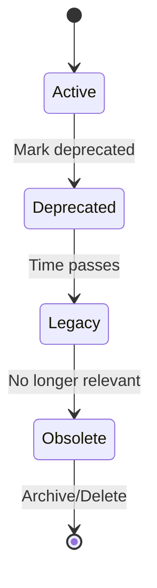

# 🧠 Core Concepts

Understanding the fundamental concepts behind SpecMem.

## SpecIR (Specification Intermediate Representation)

SpecIR is the canonical, normalized format that SpecMem uses internally. All specifications from different frameworks are converted to SpecIR.

```python
@dataclass
class SpecBlock:
    """A single specification block."""
    id: str                    # Unique identifier
    path: str                  # Source file path
    framework: str             # Source framework (kiro, cursor, etc.)
    spec_type: SpecType        # requirement, design, task, constraint
    title: str                 # Human-readable title
    content: str               # Full content
    summary: str               # Brief summary
    tags: list[str]            # Categorization tags
    lifecycle: Lifecycle       # active, deprecated, legacy, obsolete
    priority: Priority         # critical, high, medium, low
    created_at: datetime       # Creation timestamp
    updated_at: datetime       # Last update timestamp
    metadata: dict             # Additional metadata
```

### Spec Types

| Type | Description | Example |
|------|-------------|---------|
| `requirement` | What the system should do | User stories, acceptance criteria |
| `design` | How the system works | Architecture, data models |
| `task` | Implementation steps | Coding tasks, TODOs |
| `constraint` | Limitations and rules | Performance requirements, security rules |

## Memory Types

SpecMem uses different memory types for different purposes:

### 🔍 Vector Memory

Semantic search using embeddings. Best for:

- Natural language queries
- Finding related specs
- Similarity-based retrieval

```python
# Query vector memory
results = sm.query("authentication flow", top_k=5)
```

### 📌 Pinned Memory

Guaranteed recall for critical information. Best for:

- Security constraints
- Compliance requirements
- Critical business rules

```python
# Pin a spec for guaranteed recall
sm.pin_spec("security-requirements")

# Pinned specs always appear in context
bundle = sm.get_context_for_change(files)
# bundle.pinned contains all pinned specs
```

### 📊 Graph Memory

Relationship-based retrieval. Best for:

- Impact analysis
- Dependency tracking
- Test selection

```python
# Get related specs via graph
related = sm.get_related_specs("auth-service.py")
```

## Lifecycle Management

Specs progress through lifecycle stages:



| Stage | Description | Behavior |
|-------|-------------|----------|
| `active` | Current, in-use spec | Full weight in queries |
| `deprecated` | Being phased out | Reduced weight, warnings |
| `legacy` | Old but still referenced | Low weight, info only |
| `obsolete` | No longer relevant | Excluded from queries |

## Priority Levels

Specs have priority levels affecting their ranking:

| Priority | Weight | Use Case |
|----------|--------|----------|
| `critical` | 1.0 | Security, compliance, core features |
| `high` | 0.8 | Important features, key requirements |
| `medium` | 0.5 | Standard features, nice-to-haves |
| `low` | 0.3 | Minor features, future considerations |

## Architecture Overview

```
┌─────────────────────────────────────────────────────────────────┐
│                         SpecMem Core                            │
├─────────────────────────────────────────────────────────────────┤
│                                                                 │
│  ┌─────────────┐  ┌─────────────┐  ┌─────────────┐             │
│  │   Adapters  │  │   Adapters  │  │   Adapters  │             │
│  │    (Kiro)   │  │  (Cursor)   │  │  (Claude)   │  ...        │
│  └──────┬──────┘  └──────┬──────┘  └──────┬──────┘             │
│         │                │                │                     │
│         └────────────────┼────────────────┘                     │
│                          │                                      │
│                   ┌──────▼──────┐                               │
│                   │   SpecIR    │  ← Canonical Format           │
│                   └──────┬──────┘                               │
│                          │                                      │
│         ┌────────────────┼────────────────┐                     │
│         │                │                │                     │
│  ┌──────▼──────┐  ┌──────▼──────┐  ┌──────▼──────┐             │
│  │ Memory Bank │  │   Impact    │  │  SpecDiff   │             │
│  │ (Vector DB) │  │   Graph     │  │  Timeline   │             │
│  └──────┬──────┘  └──────┬──────┘  └──────┬──────┘             │
│         │                │                │                     │
│         └────────────────┼────────────────┘                     │
│                          │                                      │
│                   ┌──────▼──────┐                               │
│                   │   Client    │  ← Unified API                │
│                   └──────┬──────┘                               │
│                          │                                      │
└──────────────────────────┼──────────────────────────────────────┘
                           │
              ┌────────────┼────────────┐
              │            │            │
       ┌──────▼──────┐ ┌───▼───┐ ┌──────▼──────┐
       │     CLI     │ │  API  │ │   Web UI    │
       └─────────────┘ └───────┘ └─────────────┘
```

## Context Bundles

When you request context, SpecMem returns a `ContextBundle`:

```python
@dataclass
class ContextBundle:
    """Context package for AI agents."""
    tldr: str                      # Brief summary
    specs: list[SpecBlock]         # Relevant specs
    pinned: list[SpecBlock]        # Pinned specs (always included)
    impacted: list[SpecBlock]      # Specs impacted by changes
    recommended_tests: list[str]   # Tests to run
    warnings: list[str]            # Validation warnings
    metadata: dict                 # Additional context
```

## Embedding Models

SpecMem supports multiple embedding providers:

| Provider | Model | Dimensions | Speed | Quality |
|----------|-------|------------|-------|---------|
| Local | all-MiniLM-L6-v2 | 384 | ⚡⚡⚡ | ⭐⭐⭐ |
| OpenAI | text-embedding-3-small | 1536 | ⚡⚡ | ⭐⭐⭐⭐ |
| OpenAI | text-embedding-3-large | 3072 | ⚡ | ⭐⭐⭐⭐⭐ |

## Vector Stores

SpecMem supports multiple vector database backends:

| Backend | Best For | Persistence | Scalability |
|---------|----------|-------------|-------------|
| LanceDB | Local development | ✅ File-based | Medium |
| ChromaDB | Prototyping | ✅ File-based | Medium |
| Qdrant | Production | ✅ Server/Cloud | High |
