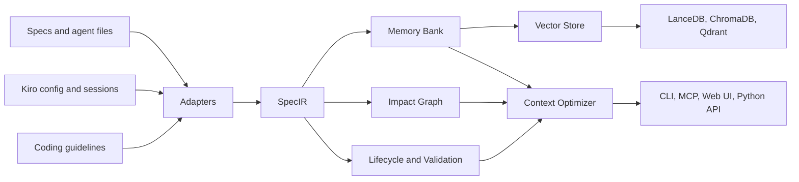

# Building a Memory Layer for Coding Agents

SpecMem can be used as a practical external memory layer for coding agents. It turns repository knowledge, specifications, coding guidelines, Kiro configuration, and previous sessions into queryable context that an agent can retrieve before it edits code.

This guide is written for developers building agent memory systems with vector search, hybrid retrieval, and structured specifications.

## What SpecMem Stores

SpecMem normalizes several kinds of project knowledge into memory:

| Source | Stored As | Why It Matters |
|--------|-----------|----------------|
| `.kiro/specs/`, SpecKit, Tessl, Claude, Cursor, Codex, Gemini, Warp, Factory | `SpecBlock` records in SpecIR | Keeps requirements, design intent, and tasks portable across agents |
| Kiro steering files, hooks, and MCP config | Structured Kiro config records | Preserves how the workspace expects agents to behave |
| Coding guidelines | Pinned or searchable constraints | Keeps style, architecture, and team rules in context |
| Kiro coding sessions | Indexed session records | Lets agents recover prior decisions and debugging history |
| Impact graph and coverage data | Relationships between specs, files, and tests | Supports targeted retrieval and selective test runs |
| Lifecycle metadata | Active, deprecated, legacy, obsolete status | Prevents stale specs from dominating results |

## Memory Architecture



The key idea is that memory is not only a vector database. The vector store finds semantically related records, while structured metadata controls what gets included, excluded, pinned, compressed, or linked to changed files.

## Retrieval Pattern

SpecMem uses a hybrid retrieval pattern:

1. **Semantic search** finds relevant specs by embedding similarity.
2. **Pinned memory** includes critical constraints even when the query would not rank them highly.
3. **Graph retrieval** connects files to specs, specs to tests, and related project concepts.
4. **Lifecycle filtering** suppresses obsolete memory and warns on deprecated memory.
5. **Token optimization** ranks, truncates, and formats context so it fits an agent budget.

```python
from specmem import SpecMemClient

sm = SpecMemClient()

bundle = sm.get_context_for_change(
    ["src/auth/service.py"],
    token_budget=4000,
)

print(bundle.to_markdown())
```

For agent integrations, expose this through MCP:

```json
{
  "mcpServers": {
    "specmem": {
      "command": "uvx",
      "args": ["specmem-mcp"]
    }
  }
}
```

The agent can then call `specmem_context`, `specmem_query`, `specmem_impact`, `specmem_validate`, and related tools before making changes.

## Qdrant for Production Memory

Use Qdrant when memory has to survive beyond a local developer machine, serve multiple agents, or scale to larger repositories.

Install the optional backend:

```bash
pip install "specmem[qdrant]"
```

Use embedded Qdrant for local experiments:

```toml
[vectordb]
backend = "qdrant"
path = ".specmem/qdrant"
```

Use Qdrant server or Qdrant Cloud for shared memory:

```toml
[vectordb]
backend = "qdrant"
path = ".specmem/qdrant"

[vectordb.qdrant]
url = "https://your-cluster.qdrant.io"
api_key = "${QDRANT_API_KEY}"
```

Qdrant gives SpecMem a production retrieval substrate while SpecMem keeps the agent-facing semantics: spec types, pinned constraints, lifecycle state, source paths, and audit history.

## Session Memory

Kiro session search turns past coding conversations into retrievable memory. This is useful when the architectural intent lives in a previous debugging or design session rather than in a formal spec.

```bash
specmem sessions config --auto --workspace-only
specmem sessions index --workspace-only
specmem sessions search "why did we choose qdrant" --days 30
specmem sessions view <session-id>
```

Use `--robot` when another tool or agent needs JSON:

```bash
specmem sessions search "auth migration decision" --robot
```

Session search currently falls back to text search when no semantic session vector store is configured, so it works as a low-friction recovery path even before a full production setup.

## Context Optimization

Long-running coding tasks fail when the agent receives either too little context or too much undifferentiated context. SpecMem’s optimizer ranks memory and fits it to a token budget:

- pinned blocks first
- then higher semantic relevance
- then complete chunks before truncated chunks
- sentence-boundary truncation when a block is too large
- JSON, Markdown, or text formatting overhead included in the budget

Use the streaming API when the agent UI or orchestration layer wants incremental context delivery:

```python
from specmem.context import StreamingContextAPI

api = StreamingContextAPI(memory_bank, default_budget=4000)

async for item in api.stream_query(
    "authentication requirements and test impact",
    profile="claude-code",
    timeout_ms=1500,
):
    print(item.to_dict())
```

Agent profiles let each coding agent use its own context preferences without changing the underlying memory store.

## Making Specs Stay Useful

A memory layer becomes noisy if stale specs never decay. SpecMem includes lifecycle tools to keep memory useful:

```bash
specmem validate
specmem health
specmem compress --all
specmem prune --orphaned
```

Use these before important agent work or in CI:

- `validate` detects contradictions, missing acceptance criteria, duplicates, and timeline issues.
- `health` scores spec quality and freshness.
- `compress` reduces verbose specs so they fit into context windows.
- `prune` archives stale or orphaned memory.

## Demo Flow for a Talk

For a live walkthrough of an agent memory layer:

1. Initialize memory in a repo:

    ```bash
    specmem init --hooks
    specmem scan
    specmem build
    ```

2. Show semantic retrieval:

    ```bash
    specmem query "What are the requirements for authentication?"
    ```

3. Show repository-scale impact:

    ```bash
    specmem graph impact src/auth/service.py
    specmem tests --file src/auth/service.py
    ```

4. Switch from local memory to Qdrant:

    ```bash
    pip install "specmem[qdrant]"
    specmem vector-backend qdrant
    specmem build
    ```

5. Recover prior session context:

    ```bash
    specmem sessions config --auto --workspace-only
    specmem sessions index --workspace-only
    specmem sessions search "architecture decision" --days 14
    ```

6. Connect an agent through MCP and call `specmem_context` before editing code.

The story to emphasize is simple: vector search finds likely memory, structured specs preserve intent, and token-aware context optimization makes the memory usable by real coding agents.
