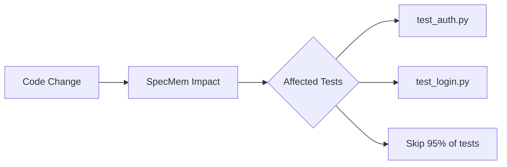

# 🎯 Selective Testing

Run only the tests that matter for your changes, saving CI time and compute costs.

## Overview

Traditional CI runs all tests on every change. SpecMem's selective testing identifies exactly which tests are affected by your changes.



## Quick Start

```bash
# Get tests affected by changed files
specmem impact --files src/auth/service.py --tests
```

Output:

```
🎯 Selective Test Recommendations

Changed files:
  • src/auth/service.py

Recommended tests (4):
  • tests/test_auth.py::test_login
  • tests/test_auth.py::test_logout
  • tests/test_auth.py::test_token_refresh
  • tests/integration/test_auth_flow.py::test_full_flow

Skipped tests (156):
  • 97% of test suite not affected

Estimated time savings: ~8 minutes
```

## How It Works

1. **Analyze Changes**: SpecMem identifies which files changed
2. **Query Impact Graph**: Find specs related to changed files
3. **Map to Tests**: Identify tests that cover those specs/files
4. **Return Recommendations**: Provide minimal test set

```python
from specmem import SpecMemClient

sm = SpecMemClient()

# Get recommended tests
tests = sm.get_recommended_tests(["src/auth/service.py"])

# Run only those tests
import subprocess
subprocess.run(["pytest"] + tests)
```

## CLI Usage

### Basic Usage

```bash
# Single file
specmem impact --files src/auth/service.py --tests

# Multiple files
specmem impact --files src/auth/service.py src/auth/models.py --tests

# From git diff
specmem impact --git-diff --tests

# From staged changes
specmem impact --git-staged --tests
```

### Output Formats

```bash
# Human readable (default)
specmem impact --files src/auth/service.py --tests

# Just test paths (for piping)
specmem impact --files src/auth/service.py --tests --format list

# JSON
specmem impact --files src/auth/service.py --tests --format json

# pytest format
specmem impact --files src/auth/service.py --tests --format pytest
```

### Running Tests

```bash
# Pipe directly to pytest
pytest $(specmem impact --files src/auth/service.py --tests --format list)

# Or use xargs
specmem impact --files src/auth/service.py --tests --format list | xargs pytest
```

## Python API

```python
from specmem import SpecMemClient

sm = SpecMemClient()

# Get recommended tests
result = sm.get_test_recommendations(["src/auth/service.py"])

print(f"Tests to run: {len(result.tests)}")
print(f"Tests skipped: {len(result.skipped)}")
print(f"Estimated savings: {result.time_savings}")

for test in result.tests:
    print(f"  • {test.path}::{test.name}")
    print(f"    Reason: {test.reason}")

# Get coverage estimate
coverage = sm.estimate_coverage(result.tests)
print(f"Estimated coverage: {coverage.percent}%")
```

## CI Integration

### GitHub Actions

```yaml
# .github/workflows/selective-tests.yml
name: Selective Tests

on: [push, pull_request]

jobs:
  test:
    runs-on: ubuntu-latest
    steps:
      - uses: actions/checkout@v4
        with:
          fetch-depth: 0  # Need full history for diff

      - name: Set up Python
        uses: actions/setup-python@v5
        with:
          python-version: '3.11'

      - name: Install dependencies
        run: |
          pip install specmem pytest

      - name: Get changed files
        id: changed
        run: |
          echo "files=$(git diff --name-only ${{ github.event.before }} ${{ github.sha }} | tr '\n' ' ')" >> $GITHUB_OUTPUT

      - name: Get selective tests
        id: tests
        run: |
          TESTS=$(specmem impact --files ${{ steps.changed.outputs.files }} --tests --format list)
          echo "tests=$TESTS" >> $GITHUB_OUTPUT

      - name: Run selective tests
        if: steps.tests.outputs.tests != ''
        run: pytest ${{ steps.tests.outputs.tests }}

      - name: No tests needed
        if: steps.tests.outputs.tests == ''
        run: echo "No tests affected by changes"
```

### GitLab CI

```yaml
# .gitlab-ci.yml
selective-tests:
  stage: test
  script:
    - pip install specmem pytest
    - CHANGED=$(git diff --name-only $CI_COMMIT_BEFORE_SHA $CI_COMMIT_SHA)
    - TESTS=$(specmem impact --files $CHANGED --tests --format list)
    - |
      if [ -n "$TESTS" ]; then
        pytest $TESTS
      else
        echo "No tests affected"
      fi
```

## Configuration

```toml
[selective_testing]
# Include integration tests
include_integration = true

# Include slow tests
include_slow = false

# Minimum confidence threshold (0-1)
confidence_threshold = 0.8

# Always run these tests
always_run = [
    "tests/test_smoke.py",
    "tests/test_critical.py",
]

# Never skip these tests
never_skip = [
    "tests/test_security.py",
]

# Test file patterns
test_patterns = [
    "tests/**/test_*.py",
    "tests/**/*_test.py",
]
```

## Confidence Levels

SpecMem provides confidence scores for test recommendations:

| Confidence | Meaning |
|------------|---------|
| 🟢 High (>0.9) | Direct relationship, high certainty |
| 🟡 Medium (0.7-0.9) | Transitive relationship |
| 🔴 Low (<0.7) | Weak relationship, consider running |

```python
result = sm.get_test_recommendations(files, min_confidence=0.8)
```

## Fallback Behavior

When SpecMem can't determine affected tests:

```toml
[selective_testing]
# What to do when uncertain
fallback = "all"  # "all", "none", "smoke"

# Smoke test suite for fallback
smoke_tests = ["tests/test_smoke.py"]
```

## Metrics

Track selective testing effectiveness:

```bash
specmem metrics tests
```

Output:

```
📊 Selective Testing Metrics (Last 30 days)

Runs: 156
Average tests run: 12 (vs 168 total)
Average time saved: 8.5 minutes
Total time saved: 22 hours

Accuracy:
  • True positives: 98.2%
  • False negatives: 1.8%
  • No regressions missed
```
