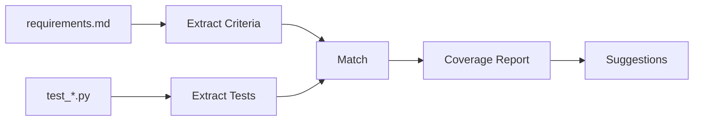

# 📊 Spec Coverage

Spec Coverage analyzes the gap between your specification acceptance criteria and existing tests.

## Overview

When you write specifications with acceptance criteria, you want to ensure those criteria are actually tested. Spec Coverage helps you:

- Identify which acceptance criteria have tests
- Find gaps where tests are missing
- Get suggestions for writing missing tests
- Track coverage over time



## Quick Start

```bash
# Check overall coverage
specmem cov

# Get detailed report for a feature
specmem cov report user-authentication

# Get test suggestions
specmem cov suggest user-authentication
```

## Understanding Coverage

### What Gets Analyzed

**Acceptance Criteria** are extracted from `requirements.md` files in your specs:

```markdown
### Requirement 1

**User Story:** As a user, I want to log in securely.

#### Acceptance Criteria

1. WHEN user provides valid credentials THEN system SHALL authenticate
2. WHEN user provides invalid credentials THEN system SHALL reject login
3. WHEN user fails login 5 times THEN system SHALL lock account
```

**Tests** are scanned from your test files:

- Python: `test_*.py`, `*_test.py` (pytest)
- JavaScript/TypeScript: `*.test.js`, `*.spec.ts` (jest, vitest)
- E2E: `*.spec.ts` (playwright)

### Matching Strategy

Coverage uses two matching strategies:

1. **Explicit Links** (confidence: 1.0)
   ```python
   def test_account_lockout():
       """Validates: 1.3"""
       pass
   ```

2. **Semantic Matching** (confidence: 0.0-1.0)
   - Compares criterion text with test names and docstrings
   - Uses text similarity algorithms

A criterion is "covered" when confidence ≥ 0.5.

## CLI Commands

### `specmem cov`

Shows overall coverage summary:

```bash
$ specmem cov

📊 Spec Coverage Report ✅
========================================
Overall: 374/463 criteria covered (80.8%)

                      Coverage by Feature  
┏━━━━━━━━━━━━━━━━━━━━━━━┳━━━━━━━━┳━━━━━━━┳━━━━━━━━━━┳━━━━━━━━━━┓
┃ Feature               ┃ Tested ┃ Total ┃ Coverage ┃      Gap ┃
┡━━━━━━━━━━━━━━━━━━━━━━━╇━━━━━━━━╇━━━━━━━╇━━━━━━━━━━╇━━━━━━━━━━┩
│ user-authentication   │      8 │    12 │    66.7% │ 33.3% ⚠️ │
│ payment-processing    │     15 │    15 │   100.0% │  0.0% ✅ │
└───────────────────────┴────────┴───────┴──────────┴──────────┘
```

### `specmem cov report`

Shows detailed coverage for a feature:

```bash
$ specmem cov report user-authentication

user-authentication ⚠️
Coverage: 8/12 (66.7%)

  ✅ AC 1.1: WHEN user provides valid credentials... → tests/test_auth.py:45
  ✅ AC 1.2: WHEN user provides invalid credentials... → tests/test_auth.py:67
  ⚠️ AC 1.3: WHEN user fails login 5 times... → NO TEST FOUND
  ⚠️ AC 1.4: WHEN session inactive 30min... → NO TEST FOUND
```

### `specmem cov suggest`

Get test suggestions for uncovered criteria:

```bash
$ specmem cov suggest user-authentication

📝 Test Suggestions for: user-authentication
==================================================

1. AC 1.3:
   "WHEN user fails login 5 times THEN system SHALL lock account"

   Suggested test approach:
   - Test file: tests/test_user_authentication.py
   - Test name: test_user_fails_login_5_times
   - What to verify:
     • Verify: the system SHALL lock account

💡 Copy these suggestions to your agent to generate the actual tests.
```

### `specmem cov badge`

Generate a coverage badge for your README:

```bash
$ specmem cov badge

```

### `specmem cov export`

Export coverage data:

```bash
# JSON format
specmem cov export --format json > coverage.json

# Markdown format
specmem cov export --format markdown > COVERAGE.md
```

## Python API

```python
from specmem import SpecMemClient

client = SpecMemClient()

# Get overall coverage
result = client.get_coverage()
print(f"Coverage: {result.coverage_percentage:.1f}%")

# Get coverage for specific feature
result = client.get_coverage("user-authentication")
for match in result.features[0].criteria:
    status = "✅" if match.is_covered else "⚠️"
    print(f"{status} {match.criterion.number}")

# Get test suggestions
suggestions = client.get_coverage_suggestions("user-authentication")
for s in suggestions:
    print(f"Missing: {s.criterion.text}")
    print(f"Suggested: {s.suggested_name}")

# Generate badge
badge = client.get_coverage_badge()
```

## Linking Tests to Criteria

For best results, add explicit links in your tests:

### Python (pytest)

```python
def test_account_lockout_after_failed_attempts():
    """Test that accounts are locked after 5 failed login attempts.

    Validates: 1.3
    """
    # Test implementation
```

### JavaScript (jest/vitest)

```typescript
// Validates: 1.3
test('account lockout after failed attempts', () => {
  // Test implementation
});
```

### Multiple Criteria

```python
def test_authentication_flow():
    """Test the complete authentication flow.

    Validates: 1.1, 1.2, 1.3
    """
    pass
```

## CI Integration

Add coverage checks to your CI pipeline:

```yaml
# .github/workflows/coverage.yml
name: Spec Coverage

on: [push, pull_request]

jobs:
  coverage:
    runs-on: ubuntu-latest
    steps:
      - uses: actions/checkout@v4

      - name: Install SpecMem
        run: pip install specmem

      - name: Check coverage
        run: specmem cov

      - name: Export report
        run: specmem cov export --format json > coverage.json

      - name: Upload report
        uses: actions/upload-artifact@v4
        with:
          name: coverage-report
          path: coverage.json
```

### Fail on Low Coverage

```bash
#!/bin/bash
# coverage-check.sh

COVERAGE=$(specmem cov --json | jq '.coverage_percentage')

if (( $(echo "$COVERAGE < 80" | bc -l) )); then
    echo "Coverage too low: $COVERAGE%"
    exit 1
fi

echo "Coverage OK: $COVERAGE%"
```

## Best Practices

!!! tip "Link Tests Explicitly"
    Add `Validates: X.Y` comments to your tests for accurate matching.

!!! tip "Run Coverage Regularly"
    Check coverage after adding new acceptance criteria.

!!! tip "Use Suggestions"
    Copy suggestions to your AI agent to generate missing tests.

!!! tip "Track Over Time"
    Export coverage reports to track improvement.

## See Also

- [CLI: specmem cov](../cli/cov.md) - Full CLI reference
- [API: Coverage](../api/coverage.md) - Python API reference
- [SpecValidator](validator.md) - Validate spec quality
