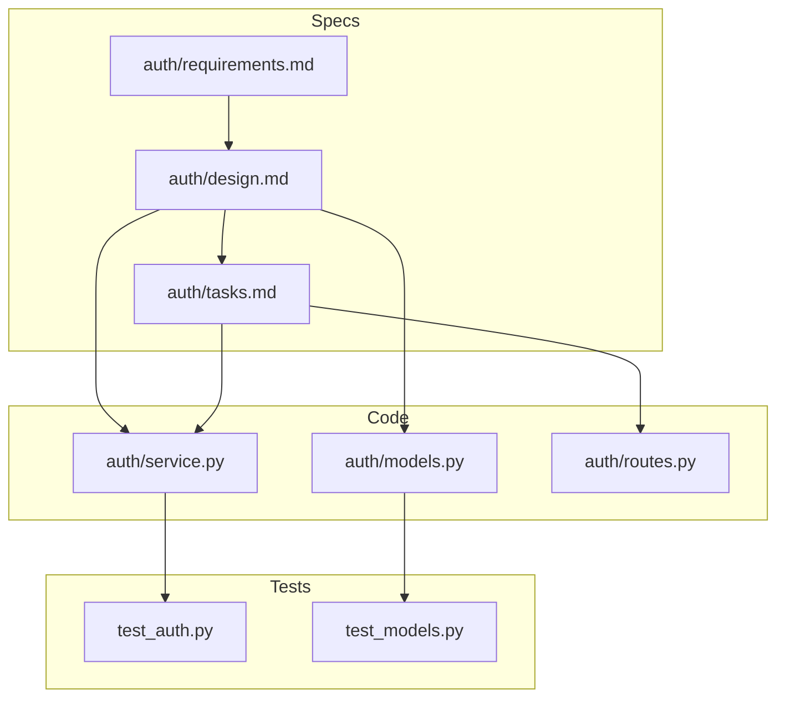

# 📊 SpecImpact Graph

The SpecImpact Graph tracks relationships between specifications, code files, and tests.

## Overview



## Building the Graph

The impact graph is built automatically during `specmem build`:

```bash
specmem build
```

Or build it explicitly:

```bash
specmem graph build
```

## Querying Impact

### CLI

```bash
# Get specs impacted by code changes
specmem impact --files src/auth/service.py

# Get impacted tests
specmem impact --files src/auth/service.py --tests

# Multiple files
specmem impact --files src/auth/service.py src/auth/models.py

# JSON output
specmem impact --files src/auth/service.py --format json
```

### Python API

```python
from specmem import SpecMemClient

sm = SpecMemClient()

# Get impacted specs
impacted = sm.get_impacted_specs(["auth/service.py"])
for spec in impacted:
    print(f"Impacted: {spec.path}")

# Get impacted tests
tests = sm.get_impacted_tests(["auth/service.py"])
for test in tests:
    print(f"Run: {test}")

# Get full impact analysis
analysis = sm.analyze_impact(["auth/service.py"])
print(f"Direct specs: {len(analysis.direct_specs)}")
print(f"Transitive specs: {len(analysis.transitive_specs)}")
print(f"Recommended tests: {len(analysis.tests)}")
```

## Relationship Types

### Spec → Spec

Specifications can reference other specifications:

| Relationship | Description |
|--------------|-------------|
| `implements` | Design implements requirements |
| `refines` | Task refines design |
| `depends_on` | Spec depends on another |
| `conflicts_with` | Specs have conflicting requirements |

### Spec → Code

Specifications link to implementation files:

| Relationship | Description |
|--------------|-------------|
| `implemented_by` | Spec is implemented by code file |
| `constrained_by` | Code is constrained by spec |

### Code → Test

Code files link to their tests:

| Relationship | Description |
|--------------|-------------|
| `tested_by` | Code is tested by test file |
| `covers` | Test covers code file |

## Traversal Depth

Control how deep the impact analysis goes:

```toml
[impact]
max_depth = 2  # Default: 2 levels
transitive = true
```

### Depth Examples

**Depth 1** (Direct only):
```
auth/service.py → auth/requirements.md
```

**Depth 2** (Include transitive):
```
auth/service.py → auth/requirements.md → api/design.md
```

## Visualizing the Graph

### Web UI

```bash
specmem serve
```

Navigate to the Graph tab for interactive visualization.

### Export

```bash
# Export as DOT format
specmem graph export --format dot > graph.dot

# Export as JSON
specmem graph export --format json > graph.json

# Export as Mermaid
specmem graph export --format mermaid > graph.md
```

### Generate Image

```bash
# Requires graphviz
specmem graph export --format dot | dot -Tpng > graph.png
```

## Filtering

Filter the graph by various criteria:

```bash
# Only show specs
specmem graph show --type specs

# Only show code relationships
specmem graph show --type code

# Filter by path pattern
specmem graph show --pattern "auth/*"

# Filter by lifecycle
specmem graph show --lifecycle active
```

## Graph Statistics

```bash
specmem graph stats
```

Output:

```
📊 SpecImpact Graph Statistics

Nodes:
  • Specs: 24
  • Code files: 156
  • Test files: 89

Edges:
  • Spec → Spec: 18
  • Spec → Code: 67
  • Code → Test: 134

Coverage:
  • Specs with code: 92%
  • Code with tests: 78%
  • Orphan specs: 2
```

## CI Integration

Use impact analysis in CI to run selective tests:

```yaml
# .github/workflows/ci.yml
- name: Get changed files
  id: changed
  uses: tj-actions/changed-files@v40

- name: Get impacted tests
  run: |
    specmem impact --files ${{ steps.changed.outputs.all_changed_files }} --tests > tests.txt

- name: Run impacted tests
  run: |
    pytest $(cat tests.txt)
```
